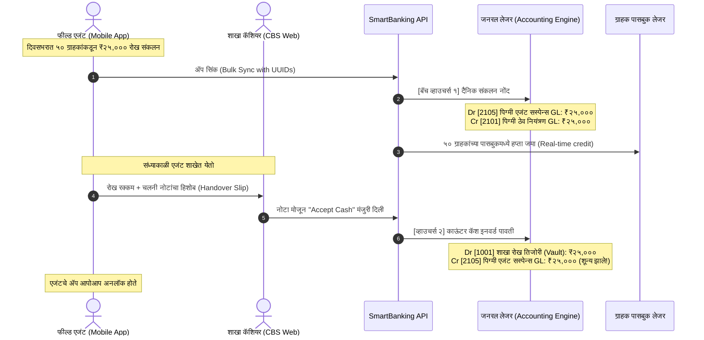

# 🏛️ Core Banking System (CBS) Enterprise Architecture Specification
## पिग्मी (दैनिक ठेव / Daily Deposit) मॉड्युल: सखोल तांत्रिक परीक्षण, त्रुटी विश्लेषण व परिपूर्ण कृती आराखडा
**SmartBanking Core Banking Solution (CBS) for Urban Banks & Credit Societies (पतसंस्था / नागरी बँक)**

---

## 📑 अनुक्रमणिका (Table of Contents)
1. [१. कार्यकारी सारांश व पार्श्वभूमी (Executive Architectural Summary)](#१-कार्यकारी-सारांश-व-पार्श्वभूमी)
2. [२. तात्काळ दुरुस्तीचे गंभीर अकाउंटिंग दोष (Critical Accounting Flaws & GL Rectification)](#२-तात्काळ-दुरुस्तीचे-गंभीर-अकाउंटिंग-दोष)
   - २.१ कॅश डबल-डेबिट (Double Debit) दोष व उपाय
   - २.२ पासबुक लेजरमध्ये व्याज नोंद न होण्याचा दोष
   - २.३ मायक्रो-व्हाउचर्स ऐवजी एकत्रित बॅच व्हाउचर्स (Consolidated Batch Posting)
3. [३. डेटाबेस व एन्टिटी मॉडेल्समधील बदल (Database Schema & Entity Specifications)](#३-डेटाबेस-व-एन्टिटी-मॉडेल्समधील-बदल)
   - ३.१ `PigmyAccounts` (वारसदार, हप्ता, तारण, बचत वर्ग)
   - ३.२ `PigmyAgents` (तारण ठेव, पॅन, TDS, डिव्हाइस आयडी)
   - ३.३ `PigmySchemes` (सस्पेन्स GL, मुदतपूर्व दंड स्लॅब)
   - ३.४ नवीन टेबल: `PigmyAgentHandoverBatches` (कॅशियर हॅन्डओव्हर)
4. [४. बँकिंग कार्यप्रवाह व ताळेबंद (End-to-End CBS Business Workflows & GL Balancing)](#४-बँकिंग-कार्यप्रवाह-व-ताळेबंद)
   - ४.१ वारसदारासह खाते उघडणे (Account Opening with Nomination)
   - ४.२ दैनिक संकलन व कॅशियर काऊंटर हॅन्डओव्हर (Collection & Counter Handover)
   - ४.३ दैनिक उत्पादन पद्धतीनुसार व्याज आकारणी (Daily Product Interest Engine)
   - ४.४ खाते बंद करणे व कर्ज तारण वजावट (Maturity Closure & Loan Lien Offset)
   - ४.५ एजंट कमिशन व कलम १९४H नुसार TDS (Commission & Section 194H TDS)
5. [५. बॅकएंड API व बिझनेस लॉजिक तपशील (Backend Architecture & API Endpoints)](#५-बॅकएंड-api-व-बिझनेस-लॉजिक-तपशील)
6. [६. फ्रंटएंड (React ERP) स्क्रीन आवश्यकता (Frontend User Experience Standards)](#६-फ्रंटएंड-react-erp-स्क्रीन-आवश्यकता)
7. [७. दिवसअखेर (EOD / Day-End) सुरक्षा व तपासणी नियम](#७-दिवसअखेर-eod--day-end-सुरक्षा-व-तपासणी-नियम)
8. [८. टप्प्याटप्प्याने अंमलबजावणी आराखडा (Phased Implementation Roadmap)](#८-टप्प्याटप्प्याने-अंमलबजावणी-आराखडा)

---

## १. कार्यकारी सारांश व पार्श्वभूमी

नागरी सहकारी बँका आणि पतसंस्थांमध्ये **पिग्मी (दैनिक ठेव / Daily Deposit)** हा सर्वात महत्त्वाचा रिटेल ठेव प्रकार आहे. यामध्ये फील्ड एजंट दररोज शेकडो छोटे दुकानदार, व्यापारी आणि गृहिणींकडून रोख रक्कम गोळा करतात.

कॅश शाखेच्या आवाराबाहेर (Off-Premises) गोळा होत असल्याने, रिझर्व्ह बँक (RBI) आणि सहकार खात्याच्या नियमांनुसार कोर बँकिंग सिस्टीममध्ये खालील **५ मुख्य स्तंभांची पूर्तता** असणे बंधनकारक आहे:
1. **शुद्ध दुहेरी नोंद ताळेबंद (Pure Double-Entry GL Balancing):** शाखेच्या प्रत्यक्ष तिजोरीतील कॅश आणि फील्डवरील एजंटकडील कॅश (Cash-in-Transit) यात स्पष्ट ताळेबंद असणे.
2. **ग्राहकाभिमुख सुरक्षा (Customer & Regulatory Safeguards):** बँकिंग नियमन कायदा कलम ४५ZA नुसार अनिवार्य वारसदार (Nomination) नोंद आणि पासबुक ऑडिट ट्रेल.
3. **तारण सुरक्षा (Loan Against Deposit Lien Protection):** पिग्मी खात्यावर तारण कर्ज दिल्यास शिल्लक आपोआप गोठवणे (Lien Marking).
4. **एजंट जोखीम नियंत्रण (Agent Risk Containment):** कमाल रोख मर्यादा (Cash Limit), एजंट तारण ठेव (Security Deposit), आणि कॅशियरकडून २-टप्प्यांची प्रत्यक्ष पडताळणी (Maker-Checker Handover).
5. **पारदर्शक व्याज व कर कपात (Statutory Accuracy):** दैनिक उत्पादन पद्धतीने (Daily Product Method) व्याज आकारणी आणि आयकर कलम १९४H नुसार कमिशनवर TDS कपात.

---

## २. तात्काळ दुरुस्तीचे गंभीर अकाउंटिंग दोष

### २.१ शाखेची कॅश दोनदा नावे (Double Debit of Cash) होणे
- **सद्यस्थितीतील त्रुटी:**
  1. जेव्हा एजंट फील्डवर कलेक्शन करतो किंवा ॲप सिंक करतो, तेव्हा `PigmyCollectionsController.cs` मध्ये खालील व्हाउचर्स पडते:
     $$\text{Dr. शाखेची रोख तिजोरी (Cash Counter GL 1001)} \quad / \quad \text{Cr. पिग्मी ठेव नियंत्रण (Pigmy Liability GL 2101)}$$
  2. त्यानंतर संध्याकाळी जेव्हा एजंट शाखेत येऊन तीच रोख रक्कम कॅशियरकडे जमा करतो, तेव्हा `AgentDayBookController.DepositCash` मध्ये पुन्हा खालील व्हाउचर्स पडते:
     $$\text{Dr. शाखेची रोख तिजोरी (Cash Counter GL 1001)} \quad / \quad \text{Cr. सस्पेन्स / पिग्मी (Suspense GL 2105)}$$
  - **गंभीर परिणाम:** प्रत्यक्ष रक्कम एकदाच जमा झाली असताना, शाखेच्या जनरल लेजरमध्ये (GL) रोख रक्कम **दोनदा डेबिट (₹२५,००० + ₹२५,००० = ₹५०,०००)** दाखवली जाते. यामुळे दिवसअखेर तिजोरीतील प्रत्यक्ष कॅश आणि सिस्टीममधील कॅश कधीच जुळत नाही.
- **CBS स्टँडर्ड योग्य पद्धत:**
  - **पायरी १ (फील्ड संकलन / ॲप सिंक):** फील्डवरील रोख रक्कम शाखेच्या तिजोरीत आलेली नसते, ती एजंटकडे असते. म्हणून:
    - **Dr. [2105] पिग्मी एजंट सस्पेन्स / Cash-in-Transit GL (Asset / Suspense)**
    - **Cr. [2101] पिग्मी ठेव नियंत्रण GL (Customer Personal Sub-Ledger credited)**
  - **पायरी २ (संध्याकाळी काऊंटरवर कॅश भरणा):** एजंटने कॅशियरला रोख दिल्यावर:
    - **Dr. [1001] शाखा रोख काऊंटर (Branch Vault Cash in Hand)**
    - **Cr. [2105] पिग्मी एजंट सस्पेन्स GL (Agent CIT Cleared to 0.00)**

---

### २.२ व्याज खात्यावर जमा होते, पण पासबुक लेजरमध्ये नोंद न पडणे
- **सद्यस्थितीतील त्रुटी:**
  [PigmyInterestController.PostInterest](file:///d:/Development/Webapps/SmartBanking/smartBanking/api/Bhisi.Api/Controllers/PigmyInterestController.cs) मध्ये व्याज मोजल्यानंतर मुख्य खात्याची शिल्लक (`account.TotalDepositedAmount += interest`) वाढते. तसेच `PigmyInterestLogs` मध्ये नोंद होते. **परंतु, ग्राहकाच्या वैयक्तिक पासबुक लेजरमध्ये ([PigmyTransaction](file:///d:/Development/Webapps/SmartBanking/smartBanking/api/Bhisi.Api/Models/PigmyTransaction.cs)) कोणतीही नोंद इन्सर्ट केली जात नाही!**
- **गंभीर परिणाम:**
  ग्राहकाने पासबुक प्रिंट केले किंवा मोबाईलवर स्टेटमेंट पाहिले, तर त्यात व्याजाची कोणतीही नोंद दिसत नाही. पासबुकमधील व्यवहारांची बेरीज आणि खात्यावरील खरी शिल्लक यात तफावत निर्माण होते.
- **CBS स्टँडर्ड योग्य पद्धत:**
  प्रत्येक खातेदारासाठी खालीलप्रमाणे ट्रान्झॅक्शन नोंद अनिवार्य आहे:
  ```csharp
  _context.PigmyTransactions.Add(new PigmyTransaction {
      PigmyAccountID = account.PigmyAccountID,
      TransactionDate = DateTime.Today,
      ValueDate = request.EndDate,
      TransactionType = "INTEREST",
      DrAmount = 0m,
      CrAmount = p.CalculatedInterest,
      BalanceAmount = account.TotalDepositedAmount,
      Narration = $"पिग्मी व्याज जमा ({request.StartDate:dd/MM/yyyy} ते {request.EndDate:dd/MM/yyyy})",
      PostedOn = DateTime.UtcNow
  });
  ```

---

### २.३ शेकडो मायक्रो-व्हाउचर्स ऐवजी एकत्रित बॅच व्हाउचर्स (Consolidated Batch Posting)
- **सद्यस्थितीतील त्रुटी:**
  सध्या एका एजंटने २०० खात्यांवरून ₹२०० गोळा केल्यास, सिस्टीम २०० स्वतंत्र व्हाउचर्स बनवते. यामुळे एकाच दिवसात हजारो व्हाउचर्स तयार होऊन जनरल लेजरचा वेग मंदावतो.
- **CBS स्टँडर्ड योग्य पद्धत:**
  ग्राहकांच्या पासबुकमध्ये २०० स्वतंत्र नोंदी पडतील, परंतु फायनान्शियल जनरल लेजरमध्ये (GL) त्या संपूर्ण बॅचचे **एकच एकत्रित व्हाउचर्स (Single Consolidated Batch Voucher)** तयार होईल:
  - **Dr. [2105] पिग्मी एजंट सस्पेन्स GL:** ₹४०,००० (एकूण बेरीज)
  - **Cr. [2101] पिग्मी ठेव नियंत्रण GL:** ₹४०,००० (एकूण बेरीज)

---

## ३. डेटाबेस व एन्टिटी मॉडेल्समधील बदल

### ३.१ `PigmyAccounts` टेबलमधील सुधारणा ([PigmyAccount.cs](file:///d:/Development/Webapps/SmartBanking/smartBanking/api/Bhisi.Api/Models/PigmyAccount.cs))

```sql
ALTER TABLE PigmyAccounts ADD
    -- वारसदार तपशील (Nomination Details)
    NomineeName NVARCHAR(100) NULL,
    NomineeRelation NVARCHAR(50) NULL,
    NomineeAge INT NULL,
    NomineeDob DATETIME NULL,
    NomineeGuardianName NVARCHAR(100) NULL,
    NominationRegNo NVARCHAR(50) NULL,

    -- दैनिक ठेव हप्ता वचनबद्धता (Daily Commitment)
    DailyTargetAmount DECIMAL(18,2) NOT NULL DEFAULT 0.00,

    -- तारण कर्ज नोंद (Lien Protection)
    IsLienMarked BIT NOT NULL DEFAULT 0,
    LienAmount DECIMAL(18,2) NOT NULL DEFAULT 0.00,
    LienLoanAccountNo NVARCHAR(50) NULL,
    LienRemarks NVARCHAR(255) NULL,

    -- मुदतीनंतर थेट बचत खात्यात वर्ग (Auto-Maturity Mandate)
    AutoCreditToSavings BIT NOT NULL DEFAULT 0,
    LinkedSavingsAccountID INT NULL;
```

---

### ३.२ `PigmyAgents` टेबलमधील सुधारणा ([PigmyAgent.cs](file:///d:/Development/Webapps/SmartBanking/smartBanking/api/Bhisi.Api/Models/PigmyAgent.cs))

```sql
ALTER TABLE PigmyAgents ADD
    -- एजंट सिक्युरिटी डिपॉझिट (FD किंवा सेव्हिंग्ज तारण)
    SecurityDepositType NVARCHAR(30) NULL DEFAULT 'FD',
    SecurityDepositAccountNo NVARCHAR(50) NULL,
    SecurityDepositAmount DECIMAL(18,2) NOT NULL DEFAULT 0.00,

    -- इन्कम टॅक्स TDS कलम 194H
    PanNo NVARCHAR(10) NULL,
    IsTdsApplicable BIT NOT NULL DEFAULT 1,

    -- अधिकृत मोबाईल डिव्हाइस बंधन (Device Binding)
    DeviceUuid NVARCHAR(100) NULL;
```

---

### ३.३ `PigmySchemes` टेबलमधील सुधारणा ([PigmyScheme.cs](file:///d:/Development/Webapps/SmartBanking/smartBanking/api/Bhisi.Api/Models/PigmyScheme.cs))

```sql
ALTER TABLE PigmySchemes ADD
    AgentSuspenseLedgerID INT NULL,       -- एजंट सस्पेन्स GL लिंकेज
    PrematurePenaltyLedgerID INT NULL,    -- मुदतपूर्व दंड उत्पन्न GL
    MinDailyDeposit DECIMAL(18,2) NOT NULL DEFAULT 20.00,
    PrematurePenaltySlabsJson NVARCHAR(MAX) NULL; -- स्लॅब कॉन्फिगरेशन
```

---

### ३.४ नवीन टेबल: `PigmyAgentHandoverBatches` (कॅशियर पडताळणी)

```sql
CREATE TABLE PigmyAgentHandoverBatches (
    HandoverId BIGINT IDENTITY(1,1) PRIMARY KEY,
    BatchNo NVARCHAR(50) NOT NULL UNIQUE,     -- उदा. HOB-20260926-AGT01-001
    AgentId INT NOT NULL FOREIGN KEY REFERENCES PigmyAgents(PigmyAgentID),
    BranchId INT NOT NULL FOREIGN KEY REFERENCES Branches(BranchID),
    HandoverDate DATETIME NOT NULL,
    TotalCollectionsCount INT NOT NULL,       -- गोळा केलेल्या पावत्यांची संख्या
    TotalCashAmount DECIMAL(18,2) NOT NULL,   -- जमा करावयाची एकूण रक्कम
    DenominationDetailsJson NVARCHAR(MAX),    -- नोटांचा हिशोब (₹500x10, ₹200x20...)
    Status NVARCHAR(20) NOT NULL DEFAULT 'SUBMITTED', -- SUBMITTED, ACCEPTED, REJECTED
    CashierUserId INT NULL,                   -- रोख मोजून घेणारा कॅशियर
    AcceptedOn DATETIME NULL,
    VoucherId INT NULL FOREIGN KEY REFERENCES Vouchers(VoucherID),
    CreatedOn DATETIME NOT NULL DEFAULT GETUTCDATE()
);
```

---

## ४. बँकिंग कार्यप्रवाह व ताळेबंद (CBS Workflows)

### ४.१ दैनंदिन संकलन व काऊंटर हॅन्डओव्हर कार्यप्रवाह



---

### ४.२ दैनिक उत्पादन पद्धतीनुसार व्याज आकारणी (Daily Product Method)

- **बँकिंग नियम:** बचत खात्याप्रमाणे पिग्मीत महिन्याच्या १० तारखेची शिल्लक धरून चालत नाही, कारण पिग्मीत **दररोज** पैसे जमा होतात. जर एखाद्याने १५ तारखेला ₹५,००० भरले तर त्याला पुढील महिन्यापर्यंत व्याज न मिळणे अन्यायकारक ठरते.
- **योग्य सूत्र:**
  $$\text{व्याज} = \frac{\sum (\text{दररोजची अखेर शिल्लक}) \times \text{व्याजदर}}{३६५ \times १००}$$
- **लेजर व्हाउचर्स:**
  - **Dr. [4102] पिग्मी ठेव व्याज खर्च GL (Expense)**
  - **Cr. [2101] पिग्मी ठेव नियंत्रण GL (Liability)**
  - *तसेच प्रत्येक ग्राहकाच्या [PigmyTransaction](file:///d:/Development/Webapps/SmartBanking/smartBanking/api/Bhisi.Api/Models/PigmyTransaction.cs) मध्ये `TransactionType = 'INTEREST'` जमा करणे.*

---

### ४.३ खाते बंद करणे व कर्ज तारण वजावट (1-Click Loan Offset)

- जर खातेदाराकडे **₹१०,००० चे कर्ज थकीत** असेल आणि पिग्मी शिल्लक **₹२५,०००** असेल:
  - **Dr. [2101] पिग्मी ठेव नियंत्रण GL:** ₹२५,००० (खाते पूर्ण बंद)
  - **Cr. [1201] कर्ज मुद्दल व व्याज GL:** ₹१०,००० (कर्ज खाते नील)
  - **Cr. [5101] मुदतपूर्व दंड उत्पन्न GL:** ₹२५० (लागू असल्यास)
  - **Cr. [1001] रोख तिजोरी / बचत खाते GL:** ₹१४,७५० (उर्वरित निव्वळ परतावा ग्राहकाला)

---

### ४.४ एजंट कमिशन व कलम १९४H नुसार ५% TDS

- आयकर कायद्यानुसार एका आर्थिक वर्षात एजंटचे कमिशन ₹१५,००० पेक्षा जास्त झाल्यास **५% TDS** कापणे बंधनकारक आहे (पॅन नसल्यास २०%).
- उदाहरण: ₹५,००० कमिशन देय झाल्यास:
  - **Dr. [4201] पिग्मी एजंट कमिशन खर्च GL:** ₹५,००० (एकूण खर्च)
  - **Cr. [2405] TDS Payable u/s 194H GL:** ₹२५० (शासनाला भरावा लागणारा कर)
  - **Cr. [2001] एजंट बचत खाते / रोख तिजोरी:** ₹४,७५० (एजंटला प्रत्यक्ष मिळालेली रक्कम)

---

### ४.५ अंशतः परतावा (Partial Return) आणि अकाली खाते बंद (Premature Break) नियमावली

#### 📌 योजनेचे मुख्य मापदंड (Scheme Parameters):
- **कमाल कालावधी (Tenure):** १२ महिने
- **नियमित व्याजदर (Full Interest Rate):** ६.५% प्रतिवर्ष (p.a.) *(११ महिने विना-उचल यशस्वीरीत्या पूर्ण केल्यावर लागू)*
- **किमान कालावधी (Min Duration):** ६ महिने
- **अकाली व्याजदर (Premature Interest Rate):** ५.५% प्रतिवर्ष (p.a.) *(६ महिने ते ११ महिन्यांच्या आत लागू)*
- **दंडव्याज / कपात (Penalty Rate):** २.०% *(३ महिन्यांच्या आत रक्कम काढल्यास लागू)*

---

#### ⏱️ कालावधीनुसार ४ मुख्य स्लॅब आणि परताव्याचे नियम (The 4 Time Slabs):

```
[ खाते सुरू ] ──(१) ० ते ३ महिने ──> [ २% दंड कपात (No Interest) ]
             ──(२) ३ ते ६ महिने ──> [ मुद्दल जशीच्या तशी (No Penalty, No Interest) ]
             ──(३) ६ ते ११ महिने ──> [ अकाली व्याज + मुद्दल (Premature Interest @ ५.५%) ]
             ──(४) ११ ते १२ महिने ──> [ पूर्ण नियमित व्याज + मुद्दल (Full Interest @ ६.५%) ]
```

| स्लॅब क्र. | कालावधी (Tenure Range) | लागू होणारा नियम | व्याजाचा दर / दंड | ग्राहकाला मिळणारी रक्कम (Net Payout Formula) |
|:---:|---|---|:---:|---|
| **१** | **० ते ३ महिन्यांच्या आत**<br>(< 3 Months) | **दंड कपात (Penalty):**<br>किमान ३ महिनेही पूर्ण न केल्यामुळे मुद्दलातून दंड वजा केला जाईल. कोणतेही व्याज मिळणार नाही. | **२.०% दंड कपात**<br>(व्याज: ०%) | **मागितलेली रक्कम – २% दंड**<br>`Net = Asked Amount - (Asked Amount × 2%)` |
| **२** | **३ महिने ते ६ महिने**<br>(3 to < 6 Months) | **बिनव्याजी मुद्दल परतावा:**<br>३ महिने पूर्ण झाल्याने दंड लागणार नाही; परंतु किमान ६ महिने पूर्ण नसल्याने व्याजही मिळणार नाही. | **०% दंड**<br>(व्याज: ०%) | **मागितलेली रक्कम जशीच्या तशी**<br>`Net = Asked Amount` |
| **३** | **६ महिने ते ११ महिने**<br>(6 to < 11 Months) | **अकाली व्याज परतावा:**<br>किमान ६ महिने पूर्ण केल्यामुळे अकाली व्याजदराने जेवढे दिवस/महिने पैसे राहिले तेवढे व्याज जोडले जाईल. | **५.५% अकाली व्याज**<br>(दंड: ०%) | **मागितलेली रक्कम + ५.५% दराने व्याज**<br>`Net = Asked Amount + Premature Interest` |
| **४** | **११ महिने ते १२ महिने**<br>(11 to 12 Months) | **पूर्ण नियमित व्याज परतावा:**<br>११ महिने यशस्वीपणे पूर्ण केल्यामुळे पूर्ण नियमित व्याजदराने लाभ मिळेल. | **६.५% पूर्ण व्याज**<br>(दंड: ०%) | **मागितलेली रक्कम + ६.५% दराने पूर्ण व्याज**<br>`Net = Asked Amount + Full Interest` |

---

#### 💡 प्रत्यक्ष आर्थिक उदाहरणे (Financial Examples):

##### उदाहरण अ: मूलभूत संकल्पना (गृहीत धरा: एकूण जमा रक्कम ₹१,००० आणि मागणी ₹५००)
१. **जर ग्राहकाने २ ऱ्या महिन्यात मागणी केली (< ३ महिने):**
   - मागितलेली रक्कम: ₹५००
   - दंड (२%): ₹१०
   - ग्राहकाला प्रत्यक्ष रोख मिळतील: **₹४९०**
   - खात्यावर उर्वरित शिल्लक: ₹५०० (₹१,००० – ₹५००) खात्यात पुढे चालू राहतील.
२. **जर ग्राहकाने ४ थ्या महिन्यात मागणी केली (३ ते ६ महिने):**
   - मागितलेली रक्कम: ₹५००
   - दंड: ₹० | व्याज: ₹०
   - ग्राहकाला प्रत्यक्ष रोख मिळतील: **₹५००** (जसेच्या तसे)
   - खात्यावर उर्वरित शिल्लक: ₹५०० पुढे चालू राहतील.
३. **जर ग्राहकाने ८ व्या महिन्यात मागणी केली (६ ते ११ महिने):**
   - मागितलेली रक्कम: ₹५००
   - व्याज (५.५% दराने ८ महिन्यांचे): ₹१८.३३
   - ग्राहकाला प्रत्यक्ष रोख मिळतील: **₹५१८.३३** (₹५०० + ₹१८.३३)
   - खात्यावर उर्वरित शिल्लक: ₹५०० पुढे चालू राहतील.
४. **जर ग्राहकाने ११ व्या महिन्यात मागणी केली (११ ते १२ महिने):**
   - मागितलेली रक्कम: ₹५००
   - व्याज (६.५% दराने ११ महिन्यांचे): ₹२९.७९
   - ग्राहकाला प्रत्यक्ष रोख मिळतील: **₹५२९.७९** (₹५०० + ₹२९.७९)
   - खात्यावर उर्वरित शिल्लक: ₹५०० पुढे चालू राहतील.

##### उदाहरण ब: दैनिक ठेव हप्ता प्रमाण (गृहीत धरा: दररोज ₹१०० जमा / दरमहा ₹३,००० जमा):
| महिना / कालावधी | एकूण जमा रक्कम | मागितलेली रक्कम (५०%) | लागू दंड दर | लागू व्याजदर | दंड रक्कम | व्याज रक्कम | ग्राहकाला मिळणारी निव्वळ रोख | खात्यात शिल्लक राहणारी मुद्दल |
|:---:|:---:|:---:|:---:|:---:|:---:|:---:|:---:|:---:|
| **२ रा महिना** (< ३) | **₹६,०००** | ₹३,००० | **२%** | ०% | ₹६० | ₹० | **₹२,९४०.००** | ₹३,०००.०० |
| **४ था महिना** (३ ते ६) | **₹१२,०००** | ₹६,००० | ०% | ०% | ₹० | ₹० | **₹६,०००.००** | ₹६,०००.०० |
| **८ वा महिना** (६ ते ११) | **₹२४,०००** | ₹१२,००० | ०% | **५.५%** | ₹० | ₹४४०.०० | **₹१२,४४०.००** | ₹१२,०००.०० |
| **११ वा महिना** (११ ते १२) | **₹३३,०००** | ₹१६,५०० | ०% | **६.५%** | ₹० | ₹९८३.१३ | **₹१७,४८३.१३** | ₹१६,५००.०० |

---

#### 🔄 अंशतः परतावा (Partial Return) वि. पूर्ण खाते बंद (Full Closure):
- **अंशतः परतावा (Partial Return / Part-Withdrawal):**
  - ग्राहक खात्यातील शिल्लक रकमेपैकी काही भाग काढतो (उदा. ₹६,००० पैकी ₹३,०००).
  - वरील ४ स्लॅबचे नियम **फक्त काढलेल्या रकमेवरच** लागू होतात.
  - उर्वरित रक्कम खात्यावर तशीच जमा राहते आणि पुढील कालावधीसाठी तिला नियमित ठेव नियमानुसार व्याज मिळत राहते.
- **पूर्ण खाते मोडणे / बंद करणे (Premature Break / Full Closure):**
  - नियम, स्लॅब आणि व्याज/दंडाची टक्केवारी **तंतोतंत हीच** राहते.
  - फरक फक्त एवढाच की, **`Asked Amount` = खात्यातील संपूर्ण जमा रक्कम** मानली जाईल आणि परतावा दिल्यानंतर खात्याची स्थिती **`Closed`** होईल.

---

#### 🎯 सारांश:
हे मॉडेल ग्राहकांसाठी अत्यंत लवचिक आहे आणि पतसंस्थेलाही मुदतपूर्व पैशांच्या व्यवस्थापनासाठी (Liquidity Management) दंडाचे व अकाली व्याजाचे योग्य संरक्षण देते.

---

## ५. बॅकएंड API व बिझनेस लॉजिक तपशील

| API रूट / एंडपॉईंट | पद्धत (HTTP) | आवश्यक बदल |
|---|:---:|---|
| `/api/PigmyAccounts` | `POST` | वारसदार (Nominee), दैनिक हप्ता, AutoCreditSavings माहिती जतन करणे. |
| `/api/PigmyAccounts/Lien/{id}` | `POST` | कर्जासाठी पिग्मी खात्यावर तारण (Lien) नोंदवणे किंवा काढणे. |
| `/api/PigmyCollections/BulkManual` | `POST` | लूपमधील स्वतंत्र व्हाउचर्स काढून शेवटी **एकाच बॅच व्हाउचर्सद्वारे** सस्पेन्स GL ला नावे करणे. |
| `/api/PigmyCollections/AppSync` | `POST` | ॲप सिंकवेळी `drLedgerId` शाखा कॅश ऐवजी `Agent Suspense GL` करणे. |
| `/api/AgentDayBook/SubmitHandover` | `POST` | *(नवीन)* एजंटने नोटांच्या तपशीलासह हॅन्डओव्हर स्लिप सबमिट करणे. |
| `/api/AgentDayBook/AcceptHandover` | `POST` | *(नवीन)* कॅशियरने नोटा पडताळून रोख स्वीकारणे व `Dr. Cash, Cr. Suspense` व्हाउचर्स बनवणे. |
| `/api/PigmyInterest/PostInterest` | `POST` | डेली प्रॉडक्ट सूत्राचा वापर करणे आणि प्रत्येक ग्राहकाच्या पासबुक लेजरमध्ये (`PigmyTransaction`) व्याज नोंद करणे. |
| `/api/PigmyClosure/Close` | `POST` | १-क्लिक कर्ज वजावट (Loan Offset) आणि थेट बचत खात्यात ट्रान्सफर व्हाउचर्स करणे. |
| `/api/AgentCommission/Pay` | `POST` | कलम १९४H नुसार ५% TDS वजावट करून `Cr. TDS Payable` ची नोंद करणे. |

---

## ६. फ्रंटएंड (React ERP) स्क्रीन आवश्यकता

### १. पिग्मी खाते उघडणे ([PigmyAccountOpening.tsx](file:///d:/Development/Webapps/SmartBanking/smartBanking/client/src/components/PigmyAccountOpening.tsx))
- **वारसदार फॉर्म विभाग:** वारसदाराचे नाव, नाते, वय, जन्मदिनांक, व अज्ञान असल्यास पालकाचे नाव.
- **दैनिक हप्ता इनपुट:** ग्राहकाचा ठरलेला दैनिक हप्ता रक्कम (उदा. ₹५०, ₹१००...).
- **पोचपावती प्रिंट:** खाते उघडण्याच्या प्रिंट कार्डवर वारसदाराचे नाव स्पष्ट दिसणे.

### २. दैनिक संकलन व काऊंटर हॅन्डओव्हर ([PigmyCollectionMaster.tsx](file:///d:/Development/Webapps/SmartBanking/smartBanking/client/src/components/PigmyCollectionMaster.tsx))
- **कॅशियर पडताळणी स्क्रीन (Cashier Verification Queue):**
  - मोबाईलवरून आलेल्या आजच्या एकूण कलेक्शनची यादी.
  - नोटा मोजणी बॉक्स (₹५००, ₹२००, ₹१००...) आणि "स्वीकारा (Accept)" बटण.

### ३. खाते बंद करणे ([PigmyClosureMaster.tsx](file:///d:/Development/Webapps/SmartBanking/smartBanking/client/src/components/PigmyClosureMaster.tsx))
- **परतावा पर्याय:**
  - [x] रोख परतावा (Cash Payout)
  - [ ] थेट बचत खात्यावर वर्ग (Transfer to SB Account)
  - [ ] थकीत कर्ज खात्यात वजावट (Adjust with Active Loan)

### ४. एजंट कमिशन वाटप ([AgentCommissionMaster.tsx](file:///d:/Development/Webapps/SmartBanking/smartBanking/client/src/components/AgentCommissionMaster.tsx))
- कमिशन यादीत ३ स्वतंत्र रकाने: **एकूण कमिशन (Gross)** | **TDS कपात ५%** | **निव्वळ देय रक्कम (Net)**.

---

## ७. दिवसअखेर (EOD / Day-End) सुरक्षा व तपासणी नियम

[EodBodService.cs](file:///d:/Development/Webapps/SmartBanking/smartBanking/api/Bhisi.Api/Services/EodBodService.cs) मध्ये दिवसअखेर क्लोजिंग करण्यापूर्वी खालील **३ सुरक्षा अटी (Validation Gates)** तपासल्या पाहिजेत:
1. **अनकन्फर्म हॅन्डओव्हर (Pending Cashier Handover):** कोणत्याही एजंटने जमा केलेली कॅश कॅशियरने मंजूर केल्याशिवाय दिवस बंद होणार नाही.
2. **मर्यादेपेक्षा जास्त रोख (Over-limit Agent Float):** कोणत्याही एजंटकडे त्याच्या ठरवून दिलेल्या कमाल मर्यादेपेक्षा जास्त रोख रक्कम रात्री शिल्लक राहू नये.
3. **सस्पेन्स लेजर शून्य पडताळणी (CIT Clearing Check):** त्या दिवसाचे संकलन आणि कॅशियरकडे जमा रक्कम जुळल्याची खात्री.

---

## ८. टप्प्याटप्प्याने अंमलबजावणी आराखडा (Implementation Roadmap)

| टप्पा | काम | उद्दिष्ट | प्राधान्य |
|:---:|---|---|:---:|
| **टप्पा १** | **कॅश डबल-डेबिट व पासबुक दुरुस्ती** | • [PigmyCollectionsController.cs](file:///d:/Development/Webapps/SmartBanking/smartBanking/api/Bhisi.Api/Controllers/PigmyCollectionsController.cs) मधील व्हाउचर्स सस्पेन्स GL ला वर्ग करणे.<br>• [AgentDayBookController.cs](file:///d:/Development/Webapps/SmartBanking/smartBanking/api/Bhisi.Api/Controllers/AgentDayBookController.cs) मध्ये कॅश आणि सस्पेन्स लेजर मॅप करणे.<br>• [PigmyInterestController.cs](file:///d:/Development/Webapps/SmartBanking/smartBanking/api/Bhisi.Api/Controllers/PigmyInterestController.cs) मध्ये पासबुक ट्रान्झॅक्शन इन्सर्ट करणे. | 🔴 अत्यंत तातडीचे |
| **टप्पा २** | **डेटाबेस व मॉडेल सुधारणा (SQL Migration)** | • `PigmyAccounts` मध्ये वारसदार (Nominee), दैनिक हप्ता (Target), तारण (Lien) कॉलम्स जोडणे.<br>• `PigmyAgents` मध्ये सिक्युरिटी डिपॉझिट, पॅन आणि डिव्हाइस आयडी जोडणे.<br>• `PigmyAgentHandoverBatches` टेबल तयार करणे. | 🟡 महत्त्वाचे |
| **टप्पा ३** | **फ्रंटएंड ERP स्क्रीन अद्ययावत करणे** | • [PigmyAccountOpening.tsx](file:///d:/Development/Webapps/SmartBanking/smartBanking/client/src/components/PigmyAccountOpening.tsx) मध्ये वारसदार आणि दैनिक हप्ता फॉर्म जोडणे.<br>• [PigmyClosureMaster.tsx](file:///d:/Development/Webapps/SmartBanking/smartBanking/client/src/components/PigmyClosureMaster.tsx) मध्ये थेट कर्ज वजावट आणि बचत ट्रान्सफर पर्याय देणे. | 🟡 महत्त्वाचे |
| **टप्पा ४** | **कॅशियर हॅन्डओव्हर, TDS व दिवसअखेर (EOD)** | • कॅशियर काऊंटर पडताळणी स्क्रीन.<br>• कमिशन वाटपात ५% TDS (कलम १९४H) कपात.<br>• दिवसअखेर (EOD) मध्ये पिग्मी कॅश पडताळणी जोडणे. | 🟢 सामान्य |

---

*दस्तऐवज तयार दिनांक: २६ सप्टेंबर २०२६ | सिस्टीम: SmartBanking Enterprise ERP & Core Banking Solution (CBS)*
