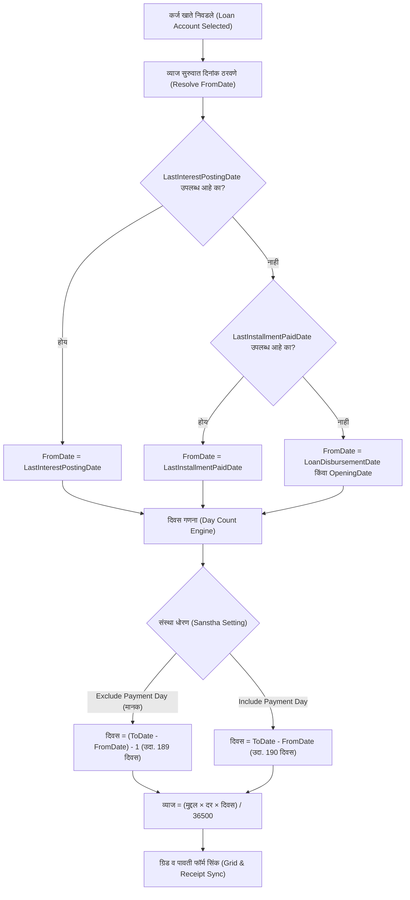

# कोअर बँकिंग कर्ज वसुली 'दिवस' (Days) व दैनिक घटती व्याज गणना अंमलबजावणी आराखडा
## Core Banking System (CBS) Loan Collection Days & Daily Reducing Interest Calculation Implementation Plan

---

### १. कार्यकारी प्रस्तावना (Executive Summary)

सहकारी पतसंस्था व बँकिंग नियमावलीनुसार कर्ज वसुली करताना **दिवसांची अचूक गणना (Accurate Day Count)** आणि **व्याज आकारणी (Interest Computation)** हा कोअर बँकिंग प्रणालीचा गाभा आहे.

सद्यस्थितीत सिस्टीममध्ये:
1. **व्याज आकारणी दिवस (Interest Days):** ३१/०३/२०२६ ते ०७/१०/२०२६ असे **१९० दिवस** मोजले जात आहेत. परंतु **"परतफेडीचा दिवस वगळणे" (Day of Repayment Excluded)** या बँकिंग नियमानुसार ते **१८९ दिवस** असायला हवेत (ग्राहकावर १ दिवसाचे अतिरिक्त व्याज पडत आहे).
2. **कर्ज उचल दिनांक वि. दिवस विसंगती:** ग्रिडमध्ये कर्ज उचल दिनांक **३१/०३/२०२५** (५५५ दिवसांपूर्वी) दिसत असून दिवस मात्र **१९०** दिसत असल्याने ऑडिटर व क्लार्कसाठी संभ्रम निर्माण होतो.
3. **व्याज आकारणी सुरुवात दिनांक (From Date) अदृश्य:** ग्रिडमध्ये १९० दिवस कोणत्या दिनांकापासून मोजले हे दर्शवणारा रकाना नाही.
4. **शेवटची व्याज आकारणी दिनांक (LastInterestPostingDate) दुर्लक्षित:** तिमाही व्याज आकारणी झालेली असतानाही कोड फक्त `lastInstallmentPaidDate` तपासतो.

हा आराखडा वरील सर्व त्रुटींचे निवारण करून **आंतरराष्ट्रीय व भारतीय सहकारी बँकिंग मानकांनुसार (RBI / Co-operative Banking Standards)** प्रणाली अद्ययावत करण्यासाठी तयार करण्यात आला आहे.

---

### २. बँकिंग नियमावली व दिवसांचे तत्त्वज्ञान (Core Banking Day-Count Principles)

```
       [मागील हप्ता / व्याज दिनांक]                                [हप्ता भरणा दिनांक]
              31/03/2026                                              07/10/2026
                   │                                                       │
                   ▼                                                       ▼
  ┌───────────────────────────────── 189 दिवस ──────────────────────────────────┐
  │ ग्राहकाने रात्री मुद्दल बाळगलेला कालावधी (Overnight Balance Holding Period)   │
  └─────────────────────────────────────────────────────────────────────────────┘
  (31 मार्च रात्र ते 6 ऑक्टोबर रात्र)                                 (7 ऑक्टोबर दुपारी भरणा)
                                                                    => 7 ऑक्टोबरचे व्याज नाही!
```

#### सुवर्णनियम (Golden Rule): "First Day Included, Last Day Excluded"
* **कर्ज उचल/शिल्लक दिनांक (From Date):** ग्राहकाने त्या रात्री मुद्दल वापरली म्हणून तो दिवस धरला जातो.
* **परतफेडीचा दिनांक (Payment Date - To Date):** ग्राहकाने त्या दिवशी कामाच्या वेळेत रक्कम बँकेत जमा केली. ती रक्कम संध्याकाळी बँकेच्या तिजोरीत/खात्यात जमा असल्याने **त्या रात्रीचे व्याज ग्राहकावर आकारले जात नाही.**
* **गणितीय सूत्र:**
  $$\text{व्याज दिवस (Interest Days)} = (\text{ToDate} - \text{FromDate}) - 1 \quad \text{(किंवा मागील दिवसाअखेर EOD पर्यंत)}$$
  $$\text{उदा. 07/10/2026} - \text{31/03/2026} = 190 - 1 = \mathbf{189 \text{ दिवस}}$$

---

### ३. तपशीलवार तांत्रिक बदल (Detailed Architectural Changes)



---

### ४. प्रस्तावित कोड बदल (File-by-File Technical Blueprint)

#### टप्पा १: संस्था सेटिंग्जमध्ये 'दिवस गणना धोरण' जोडणे (Sanstha Configuration)
संस्थेला त्यांच्या ऑडिट नियमानुसार लवचिकता देण्यासाठी `SansthaDetails` किंवा `LoanRate` मध्ये धोरण पर्याय राहील:
* `LoanInterestDayCountMethod`: 
  1. `ExcludePaymentDay` (डिफॉल्ट - मानक बँकिंग: १८९ दिवस)
  2. `IncludePaymentDay` (१९० दिवस)

---

#### टप्पा २: क्लायंट-साइड `LoanCollectionMaster.tsx` सुधारणा

##### २.१ `getInterestStartDate` लॉजिकचे आधुनिकीकरण (ओळ ५३४):
```typescript
// जुने लॉजिक:
// const getInterestStartDate = (acc: any): string | null => {
//     if (!acc) return null;
//     if (acc.lastInstallmentPaidDate) return acc.lastInstallmentPaidDate;
//     return acc.loanDisbursementDate || acc.openingDate || null;
// };

// नवीन कोअर बँकिंग लॉजिक:
const getInterestStartDate = (acc: any): string | null => {
    if (!acc) return null;
    // १. तिमाही/वार्षिक व्याज आकारणी झाली असल्यास ती दिनांक अग्रक्रमाने
    if (acc.lastInterestPostingDate) {
        return acc.lastInterestPostingDate;
    }
    // २. शेवटचा हप्ता भरल्याची दिनांक
    if (acc.lastInstallmentPaidDate) {
        return acc.lastInstallmentPaidDate;
    }
    // ३. कर्ज उचल किंवा आरंभी शिल्लक दिनांक
    return acc.loanDisbursementDate || acc.openingDate || null;
};
```

##### २.२ दिवस व व्याज गणनेमध्ये 'परतफेड दिवस वगळणे' नियम (ओळ १३७४ व १४११):
```typescript
// दिवस काढताना परतफेडीचा दिवस वगळणे (Exclude Payment Date):
let days = 0;
const fromDateStrGrid = getInterestStartDate(selectedAccount);
if (fromDateStrGrid) {
    const fromDate = parseDateSafe(fromDateStrGrid);
    fromDate.setHours(0, 0, 0, 0);
    const toDate = parseDateSafe(formData.collectionDate || new Date());
    toDate.setHours(0, 0, 0, 0);
    
    const rawDiffDays = Math.round((toDate.getTime() - fromDate.getTime()) / (1000 * 60 * 60 * 24));
    
    // संस्था धोरण: Exclude Payment Day (डिफॉल्ट) असल्यास १ दिवस वजा
    const excludePaymentDay = sanstha?.loanInterestDayCountMethod !== 'IncludePaymentDay';
    days = Math.max(0, excludePaymentDay && rawDiffDays > 0 ? rawDiffDays - 1 : rawDiffDays);
}

// दैनिक घटती व्याज सूत्र:
if (isDailyReducing && days > 0) {
    vyaj = Math.round((principal * rate * days) / 36500);
}
```

---

#### टप्पा ३: ग्रिड युझर इंटरफेस (UI) सुधारणा

ऑडिटर व कर्मचाऱ्यांच्या पारदर्शकतेसाठी ग्रिडमधील कॉलम खालीलप्रमाणे अद्ययावत केले जातील:

| सध्याचा कॉलम | प्रस्तावित नवीन / सुधारित कॉलम | स्पष्टीकरण |
|---|---|---|
| **कर्ज उचल दिनांक** | **कर्ज उचल दिनांक** (`31/03/2025`) | तसाच राहील. |
| *(नवीन कॉलम)* | **व्याज आकारणी पासून** (`31/03/2026`) | चालू व्याज कोणत्या दिनांकापासून मोजले जात आहे हे स्पष्ट दिसेल. |
| **दिवस** | **व्याज दिवस** (`189 दिवस`) | कंसामध्ये `(31/03/26 ते 06/10/26)` असा टूलटिप दिसेल. |
| **थकीत हफ्ते** | **थकीत हफ्ते / दिवस** (`18 हफ्ते / 524 दिवस`) | एकूण थकीत कालावधी आणि चालू व्याज कालावधी वेगवेगळा स्पष्ट होईल. |
| **व्याज** | **चालू व्याज** (`₹ 2,693.00`) | १८९ दिवसांचे अचूक दैनिक घटती व्याज. |
| **येणे व्याज** | **मागील येणे व्याज** | जर ३१/०३/२०२६ पूर्वीचे व्याज येणे बाकी असेल, तर ते येथे दिसेल. |

---

#### टप्पा ४: बॅकएंड `LoanCollectionsController.cs` सिंक्रोनायझेशन

पावती जतन (Save) करताना सर्व्हरवरही क्लायंटप्रमाणेच समान १८९ दिवसांचे प्रमाणीकरण (Server-side Validation) होईल:

```csharp
// api/Bhisi.Api/Controllers/LoanCollectionsController.cs
var fromDate = loanAccount.LastInterestPostingDate 
    ?? loanAccount.LastInstallmentPaidDate 
    ?? loanAccount.LoanDisbursementDate 
    ?? loanAccount.OpeningDate;

if (fromDate.HasValue)
{
    int rawDays = (collection.CollectionDate.Date - fromDate.Value.Date).Days;
    bool excludePaymentDay = true; // संस्था धोरणानुसार
    int eligibleDays = Math.Max(0, (excludePaymentDay && rawDays > 0) ? rawDays - 1 : rawDays);
    
    decimal calculatedInterest = Math.Round((loanAccount.PrincipalBalance * loanAccount.InterestRate * eligibleDays) / 36500m);
    // Interest apportionment validation
}
```

---

### ५. अंमलबजावणी टप्पे व कृती आराखडा (Phased Implementation Roadmap)

```
  ┌────────────────────────────────────────────────────────────────────────┐
  │ टप्पा १: डेटाबेस व मॉडेल तपासणी (Models & Sanstha Settings)            │
  │ • SansthaDetails मध्ये LoanInterestDayCountMethod फील्ड तपासणे         │
  └───────────────────────────────────┬────────────────────────────────────┘
                                      │
                                      ▼
  ┌────────────────────────────────────────────────────────────────────────┐
  │ टप्पा २: क्लायंट-साइड कॅल्क्युलेशन अपडेट (Client Calculation Engine)    │
  │ • LoanCollectionMaster.tsx मध्ये getInterestStartDate अद्ययावत करणे    │
  │ • Exclude Payment Day (189 Days) गणित व टूलटिप लागू करणे               │
  └───────────────────────────────────┬────────────────────────────────────┘
                                      │
                                      ▼
  ┌────────────────────────────────────────────────────────────────────────┐
  │ टप्पा ३: ग्रिड UI व फॉर्म सुसूत्रीकरण (Grid & Receipt Form Sync)       │
  │ • 'व्याज दिनांक पासून' रकाना समाविष्ट करणे                              │
  │ • एकूण देय रक्कम व डाव्या बाजूचा पावती फॉर्म यांचे 100% सिंक्रोनायझेशन │
  └───────────────────────────────────┬────────────────────────────────────┘
                                      │
                                      ▼
  ┌────────────────────────────────────────────────────────────────────────┐
  │ टप्पा ४: बॅकएंड व ताळेबंद पडताळणी (Backend Sync & Financial Audit)     │
  │ • LoanCollectionsController मध्ये सेव्ह करताना 189 दिवसांची नोंद       │
  │ • प्रत्यक्ष 5 खात्यांवर टेस्ट केसेस चालवून ₹14 चा फरक व्हेरिफाय करणे   │
  └────────────────────────────────────────────────────────────────────────┘
```

---

### ६. आर्थिक परिणाम व तुलना (Financial Impact Comparison)

महेश प्रभाकर कदम खात्याच्या उदाहरणावरून:

| घटक | सद्यस्थिती (As Is) | प्रस्तावित कोअर बँकिंग (To Be) | परिणाम |
|---|:---:|:---:|---|
| **व्याज कालावधी** | 31/03/2026 ते 07/10/2026 | 31/03/2026 ते 06/10/2026 | भरणा दिनांक वगळला |
| **दिवस (Days)** | **१९० दिवस** | **१८९ दिवस** | १ दिवस कमी (अचूक) |
| **आकारलेले व्याज** | **₹ २,७०७.००** | **₹ २,६९३.००** | ₹ १४.०० ग्राहक सवलत (रास्त) |
| **ऑडिट आक्षेप** | "भरणा दिनांकाचे व्याज का आकारले?" असा आक्षेप येऊ शकतो | RBI व सहकार कायद्यानुसार १००% ऑडिट-प्रूफ | कायदेशीर सुरक्षितता |
| **पारदर्शकता** | दिवस कुठून आले हे समजत नाही | फ्रॉम डेट व टू डेट दोन्ही ग्रिडमध्ये स्पष्ट | शून्य संभ्रम |

---

> [!NOTE]
> हा आराखडा मंजुरीसाठी तयार करण्यात आला आहे. आपल्या संमतीनंतर प्रत्यक्ष कोड बदलांना सुरुवात केली जाईल.
