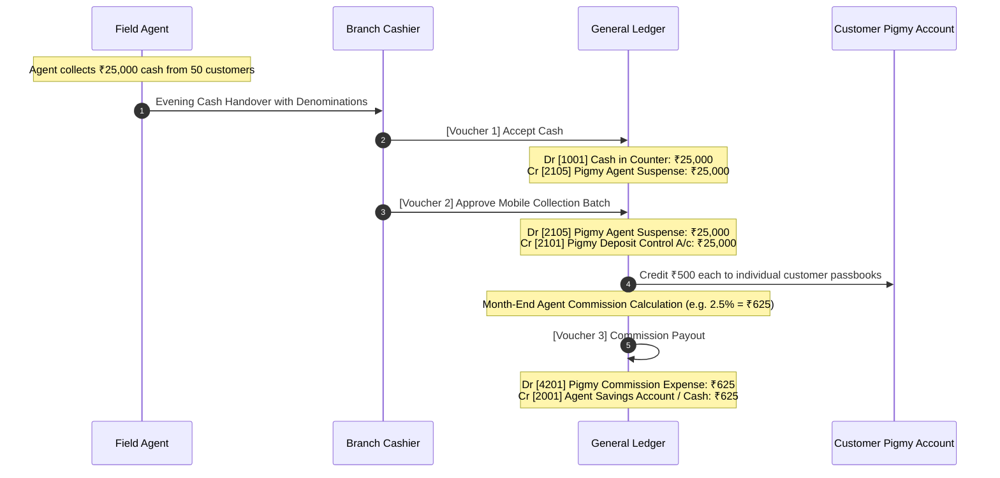

# Enterprise CBS Pigmy Architecture & Implementation Plan
**Web Application (Back-Office ERP) & Android Mobile Application (Field Agent App)**

---

## 🏛️ Executive Architectural Summary

In a regulated Cooperative Credit Society / Urban Bank (पतसंस्था / नागरी बँक), the **पिग्मी (दैनिक ठेव / Daily Deposit)** module is the primary lifeline for retail liquidity. It involves field agents collecting cash from hundreds of small shopkeepers, vendors, and households daily. 

Because cash is collected outside branch premises, a professional Core Banking System (CBS) requires a **bulletproof 3-tier architecture**:
1. **Android Mobile Application (Field Agent):** Offline-first, device-bound, Bluetooth thermal printing, tamper-resistant transaction queuing, and real-time/batch sync.
2. **CBS Web Application (Branch / Back-Office):** Agent management, cash limit controls, cashier counter handover, batch collection approval, automated interest accrual, maturity/closure processing, and audit reports.
3. **Core Banking Engine (Backend API & Database):** 100% Pure Customer-First (CIF), strict double-entry ledger balancing (Dr = Cr), idempotent sync (0 duplicate entries), and automated agent risk locking.

```
 [ Field Agent ]                     [ Branch Counter ]                    [ CBS Accounting Engine ]
 Android Mobile App                  CBS Web Application                   .NET 10 API & SQL Server
┌──────────────────────┐            ┌────────────────────────┐            ┌─────────────────────────┐
│ • Offline Room DB    │            │ • Agent Master & Limit │            │ • Pure CIF Architecture │
│ • Instant Bluetooth  │ Sync HTTP  │ • Cashier Handover     │ Double-    │ • Idempotent Sync       │
│   ESC/POS Printing   │───────────>│ • Batch Posting / GL   │───────────>│ • Automated Agent Lock  │
│ • GPS & Device UUID  │            │ • Maturity / Closure   │ Entry      │ • Daily Accruals & TDS  │
│ • Bi-lingual Marathi │            │ • 360° Passbook Audit  │            │ • Dr = Cr Balancing     │
└──────────────────────┘            └────────────────────────┘            └─────────────────────────┘
```

---

## 1. Web Application (CBS Back-Office) Architecture

### 1.1 Core Modules & Responsibilities

| Module | Features & CBS Rules |
|---|---|
| **1. Pigmy Scheme Master** | • योजना कोड, व्याजदर (उदा. 3% ते 5%), कालावधी (12 ते 36 महिने).<br>• किमान दैनिक ठेव मर्यादा (Min Daily Deposit, उदा. ₹50).<br>• मुदतपूर्व बंद नियम (Premature rules) व दंडात्मक व्याज कपात.<br>• एजंट कमिशन स्लॅब (उदा. 2% ते 3% ठेवीवर आधारित). |
| **2. Pigmy Agent & Device Master** | • **एजंट सिक्युरिटी डिपॉझिट:** एजंटचे स्वतःचे तारण ठेव/FD खात्याशी लिंकेज.<br>• **कॅश मर्यादा (Max Cash-in-Hand Limit):** उदा. ₹50,000 पेक्षा जास्त रक्कम हातात राहू नये.<br>• **कमाल लॉक दिवस (Max Lock Days):** जर एजंटने २ दिवसांपेक्षा जास्त दिवस गोळा केलेली रोख शाखेत जमा केली नाही, तर ॲप आपोआप लॉक होते.<br>• **Device Binding:** अधिकृत Android डिव्हाइस आयडी / IMEI चे बंधन. |
| **3. Pigmy Account Opening (CIF-First)** | • शुद्ध ग्राहक (Pure Customer) CIF नंबरवरून थेट खाते उघडणे (सभासदत्व ऐच्छिक).<br>• वारसदार (Nominee) तपशील, एजंट टॅगिंग, दैनिक टार्गेट रक्कम.<br>• संगणकीय युनिक पासबुक खाते क्रमांक (उदा. `101-PG-00045`). |
| **4. Cash Handover & Counter Reconciliation** | • एजंट दिवसअखेर शाखेत येतो -> कॅशियरला रोख रक्कम देतो.<br>• **डिनॉमिनेशन पडताळणी:** ₹500, ₹200, ₹100 नोटांचा हिशोब.<br>• कॅशियरने स्वीकारताच व्हाउचर तयार: **Dr Cash in Hand, Cr Agent Collection Suspense**. |
| **5. Batch Collection Approval & GL Posting** | • मोबाईलवरून सिंक झालेल्या सर्व पावत्यांची यादी.<br>• मॅनेजर/कॅशियर १-क्लिकवर पडताळणी करून पास करतो.<br>• बॅच पास होताच: **Dr Agent Collection Suspense, Cr Pigmy Deposit GL (Customer Sub-Ledger)**. |
| **6. Daily/Monthly Interest Accrual & Posting** | • **दैनिक उत्पादन पद्धत (Daily Product Method):** दररोजच्या शिल्लकेवर व्याज गणना.<br>• त्रैमासिक/वार्षिक चक्रवाढ किंवा मुदत संपताना जमा.<br>• व्हाउचर: **Dr Interest on Pigmy Deposit, Cr Customer Pigmy Account**. |
| **7. Maturity Settlement & Premature Closure** | • मुदत पूर्ण झाल्यावर थेट बचत खात्यात ट्रान्सफर किंवा रोख प्रदान.<br>• मुदतपूर्व बंद केल्यास नियमानुसार व्याज कपात (Penalty Deductions).<br>• **कर्ज तारण लिंकेज (Lien):** पिग्मीवर कर्ज (Loan Against Pigmy) असल्यास शिल्लक आधी कर्जाकडे वर्ग. |

---

### 1.2 CBS Double-Entry Accounting Flow (नावे/जमा ताळेबंद)



---

## 2. Android Mobile Application (Field Agent App) Architecture

*(हा ॲप तुम्ही दुसऱ्या PC वर Android Studio मध्ये विकसित करत आहात; त्यासाठी ही Enterprise रचना वापरा)*

### 2.1 Recommended Technology Stack (Android)
- **Language:** Kotlin (100%)
- **UI Framework:** Jetpack Compose किंवा Clean Material Components (XML)
- **Local Database (Offline Cache):** **Room Database** (SQLite) + SQLCipher (डिव्हाइसवरील डेटा सुरक्षिततेसाठी)
- **Network & API:** Retrofit 2 + OkHttp 4 (with Auth Interceptor)
- **Background Sync:** Android Jetpack **WorkManager** (नेटवर्क येताच आपोआप पार्श्वभूमीत सिंक)
- **Bluetooth Printing:** Android Bluetooth SPP (ESC/POS 58mm / 80mm Thermal Printer)
- **Security & Keystore:** Android Keystore + EncryptedSharedPreferences (JWT टोकन सुरक्षित ठेवण्यासाठी)

---

### 2.2 Android App Package Structure (MVVM Clean Architecture)

```
com.smartbanking.pigmy
├── data
│   ├── local
│   │   ├── dao (AccountDao, CollectionDao, SchemeDao, SyncQueueDao)
│   │   ├── entity (AccountEntity, CollectionEntity, SyncQueueEntity)
│   │   └── AppDatabase.kt
│   ├── remote
│   │   ├── PigmyApiService.kt
│   │   ├── AuthInterceptor.kt
│   │   └── NetworkResult.kt
│   └── repository
│       ├── AuthRepository.kt
│       ├── AccountRepository.kt
│       ├── CollectionRepository.kt
│       └── SyncRepository.kt
├── domain
│   ├── model (CustomerAccount, CollectionReceipt, AgentSummary)
│   └── usecase (CollectDepositUseCase, SyncPendingCollectionsUseCase, PrintReceiptUseCase)
├── presentation
│   ├── auth (LoginActivity, DeviceLockActivity)
│   ├── dashboard (DashboardActivity, CashSummaryFragment)
│   ├── collection (AccountSearchActivity, DepositEntryActivity, ReceiptActivity)
│   ├── onboarding (NewCustomerActivity, KycUploadActivity)
│   ├── printer (BluetoothDeviceSelectActivity, ThermalPrintManager.kt)
│   └── reports (DailyCollectionListActivity, PassbookStatementActivity)
└── utils
    ├── MarathiDateFormatter.kt
    ├── NumberToWordsMarathi.kt
    └── DeviceIdProvider.kt
```

---

### 2.3 Android Local Database Schema (Room Offline Store)

```kotlin
// 1. ग्राहक खाती (स्थानिक शोध व शिल्लक तपासणी)
@Entity(tableName = "cached_accounts")
data class CachedAccountEntity(
    @PrimaryKey val accountId: Long,
    val accountNo: String,
    val customerId: Long,
    val cifNo: String,
    val customerName: String,
    val customerNameEng: String,
    val mobileNo: String,
    val village: String,
    val currentBalance: Double,
    val dailyTarget: Double,
    val status: String // Active / Suspended
)

// 2. ऑफलाइन संकलन रांग (Sync Queue)
@Entity(tableName = "pending_collections")
data class PendingCollectionEntity(
    @PrimaryKey val transactionUuid: String, // e.g. UUID.randomUUID()
    val accountId: Long,
    val accountNo: String,
    val customerName: String,
    val amount: Double,
    val timestamp: Long,
    val latitude: Double,
    val longitude: Double,
    val receiptNo: String,
    val isSynced: Boolean = false,
    val syncAttemptCount: Int = 0,
    val syncErrorMessage: String? = null
)
```

---

### 2.4 Bluetooth 58mm Thermal Print Receipt Format (मराठी व इंग्रजी)

```text
================================
  श्री जोतिर्लिंग नागरी पतसंस्था
    शाखा: पडवळवाडी  |  पिग्मी पावती
================================
पावती क्र.  : REC-20260915-0042
दिनांक/वेळ : 15/09/2026 11:45 AM
एजंट नाव   : गणेश पाटील (AG01)
--------------------------------
खाते क्रमांक: 101-PG-00045
खातेदार नाव: विकास तानाजी शिंदे
CIF क्रमांक : CIF000012
--------------------------------
जमा रक्कम  : Rs. 200.00
अक्षरी      : दोनशे रुपये फक्त.
--------------------------------
मागील शिल्लक: Rs. 12,400.00
नवीन शिल्लक : Rs. 12,600.00
================================
  बचत हीच खरी संपत्ती! धन्यवाद!
  मोबाईल ॲप: SmartBanking ERP
================================
```

---

## 3. End-to-End API Specifications (Mobile App ⇄ Web Backend)

*(सध्या Backend मधील PigmyMobileApiController.cs व MOBILE_APPLICATION_API.md शी १००% सुसंगत)*

| Method | Endpoint | Description |
|---|---|---|
| `POST` | `/api/Auth/login` | एजंट लॉगिन, JWT टोकन, एजंट आयडी व रोल. |
| `GET` | `/api/agent/lock-status` | एजंटची शिल्लक रोख रक्कम तपासणे व लॉक स्थिती (Allowed Cash Limit / Days). |
| `GET` | `/api/accounts` | एजंटच्या रूटवरील सर्व सक्रिय खात्यांची संपूर्ण यादी (Offline Cache साठी). |
| `POST` | `/api/collections` | रिअल-टाईम सिंगल डिपॉझिट (ऑनलाइन असताना). |
| `POST` | `/api/collections/bulk-sync` | नेटवर्क आल्यावर सर्व ऑफलाइन नोंदी एकाच वेळी सिंक करणे (इडेम्पोटंट UUID सह). |
| `POST` | `/api/AgentCustomerRequests` | एजंटने फील्डवर नवीन खातेदाराचा फॉर्म व KYC फोटो भरून मंजुरीसाठी पाठवणे. |
| `GET` | `/api/dashboard/summary` | एजंटने आज गोळा केलेली एकूण रक्कम, खाती संख्या व कमिशन अंदाज. |
| `POST` | `/api/pigmyagentcashdeposits` | शाखेत रोख रक्कम भरल्यानंतर कॅशियरची पोचपावती नोंद. |

---

## 4. Phase-Wise Execution Plan (पायरीनिहाय अंमलबजावणी)

### 🔹 Phase 1: Web Application (CBS Back-Office) परिपूर्ण करणे
1. **Agent Risk & Limit System:**
   - `PigmyAgentMaster.tsx` मध्ये कॅश मर्यादा (Max Cash-in-Hand) व कमाल लॉक दिवस (Max Lock Days) चे व्हॅलिडेशन तपासणे.
2. **Batch Approval & Counter Handover UI:**
   - `PigmyCollectionMaster.tsx` मध्ये एजंटनिहाय फिल्टर, आजची एकूण रोख रक्कम, आणि कॅशियर अप्रूव्हल स्क्रीन जोडणे.
3. **Interest & TDS Engine:**
   - `PigmyInterestPosting.tsx` मध्ये डेली प्रॉडक्ट पद्धतीने व्याज गणना आणि GL व्हाउचर पोस्टिंग पडताळणी.

### 🔹 Phase 2: Android App Development (दुसऱ्या PC वरील काम)
1. **Project Setup & Base Architecture:**
   - Android Studio मध्ये Clean Architecture + MVVM + Retrofit + Room Database कॉन्फिगर करणे.
2. **Device Security & Auth:**
   - Login Screen, JWT Token Storage (Keystore), आणि Agent Lock Status चेक.
3. **Offline Cache & Room Sync:**
   - `/api/accounts` वरून डेटाबेस स्थानिक डाऊनलोड करणे (Pull) आणि शोध (Search by Name/AccNo/CIF).
4. **Instant Collection & Thermal Bluetooth Printing:**
   - हप्ता नोंदणी स्क्रीन -> ESC/POS प्रिंटरला ब्लूटूथ द्वारे पावती पाठवणे -> स्थानिक रूम डेटाबेसमध्ये सेव्ह.
5. **Background Sync Worker:**
   - `WorkManager` द्वारे नेटवर्क उपलब्ध होताच सर्व ऑफलाइन पावत्या `/api/collections/bulk-sync` ला पुश करणे.

### 🔹 Phase 3: सुरक्षा, चाचणी व प्रत्यक्ष फील्ड ट्रायल
1. **Duplicate Prevention Test:** नेटवर्क तुटले तरी एकाच पावतीची दोनदा नोंद होणार नाही (UUID Idempotency).
2. **Agent Lockout Test:** रोख जमा न केल्यास ॲप संकलन थांबवते का याची खात्री.
3. **End-to-End Trial:** मोबाईलवर जमा केलेले ₹200 वेब ॲपच्या पासबुक व डे-बुकमध्ये अचूक दिसतात का याची प्रत्यक्ष पडताळणी.

---

> **टीप:** हा प्लॅन Senior CBS Banking Architect च्या सर्व आंतरराष्ट्रीय सुरक्षा, डबल-एंट्री लेजर ऑडिट आणि ऑफलाइन मोबाईल मानकांनुसार तयार केला आहे.
