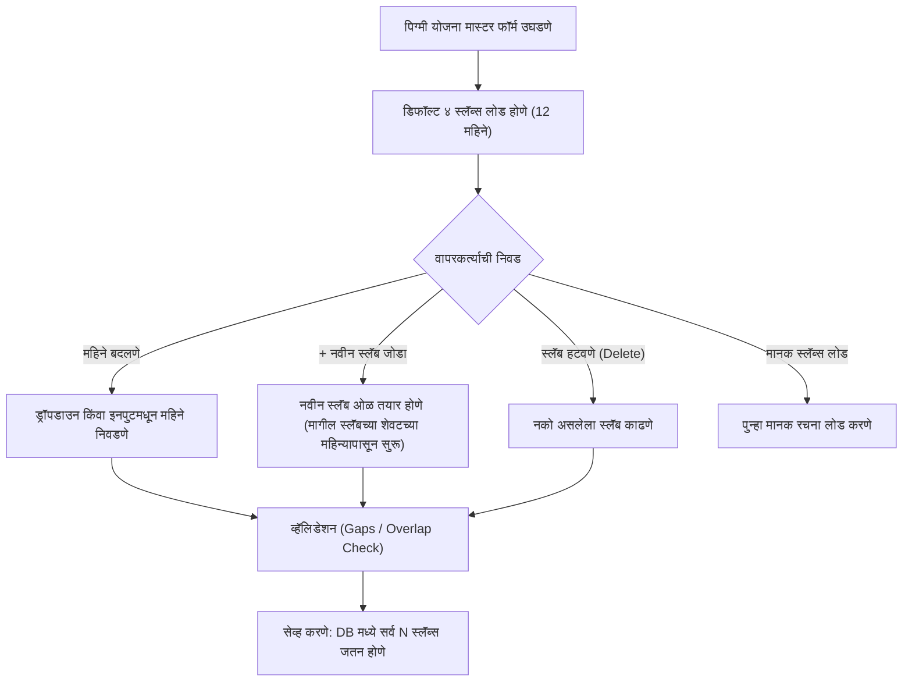

# अंमलबजावणी आराखडा: पिग्मी योजना डायनॅमिक स्लॅब्स व महिने निवड प्रणाली
## (Implementation Plan: Dynamic Slabs & Month Selector in Pigmy Scheme Master)

---

### 📌 १. पार्श्वभूमी व उद्दिष्ट (Background & Objective)
सध्या पिग्मी योजनेसाठी निश्चित ४ स्लॅब्स दाखवले जातात. परंतु बँकेच्या विविध प्रकारच्या पिग्मी योजनांसाठी (उदा. ६ महिने, १२ महिने, १८ महिने, २४ महिने किंवा ३६ महिने) **अधिक स्लॅब्स जोडण्याची (Add More Slabs)** आणि प्रत्येक स्लॅबमध्ये **महिने निवडण्याची (Select Months per Slab)** लवचिकता (Flexibility) हवी आहे.

> **महत्त्वाची सूचना:** या आराखड्यानुसार वापरकर्त्याच्या मंजुरीशिवाय कोडमध्ये कोणताही बदल करण्यात आलेला नाही.

---

### 🏗️ २. प्रस्तावित आर्किटेक्चर व कार्यपद्धती (Proposed Architecture & Workflow)

---

### 🎨 ३. यूआय (UI) डिझाईन व महिने निवड पद्धत (Month Selection Design)

प्रत्येक स्लॅबच्या ओळीत खालीलप्रमाणे नियंत्रणे दिली जातील:

#### अ. महिने निवडण्यासाठी २ पर्याय (Selection Methods):
1. **पर्याय १: सुलभ महिने ड्रॉपडाउन (Dropdown Selector - Recommended):**
   - **किमान महिने (From M):** मागील स्लॅब जिथे संपला तिथून आपोआप सुरू होतो (उदा. ०, ३, ६, ११, १२...). यामुळे महिन्यांमध्ये गॅप किंवा ओव्हरलॅप होण्याची शक्यता शून्य राहते.
   - **कमाल महिने (To M):** ड्रॉपडाउनमधून महिने निवडता येतील: `[ १ ते ३६ महिने ]`.
2. **पर्याय २: लवचिक मॅन्युअल इनपुट (Number Input with Live Validation):**
   - दोन्ही संख्या मॅन्युअली टाईप करता येतील, आणि काही चुका (उदा. सुरुवातीचा महिना शेवटच्या महिन्यापेक्षा मोठा असणे) असल्यास तांबड्या रंगात इशारा (Validation Badge) दिसेल.

#### ब. स्लॅब ओळीची रचना (Columns per Slab Row):
| # | किमान महिने (From) | कमाल महिने (To) | व्याजदर (% p.a.) | दंड दर (% Penalty) | नियम शेरा / वर्णन | परतावा प्रकार | कृती (Action) |
| :-: | :---: | :---: | :---: | :---: | :---: | :---: | :-: |
| **१** | `०` महिने | `[ ३ ▼ ]` महिने | `0.00 %` | `[ २.० ] %` | ० ते ३ महिने (२% दंड) | 🔴 दंड कपात | 🗑️ |
| **२** | `३` महिने | `[ ६ ▼ ]` महिने | `0.00 %` | `[ ०.० ] %` | ३ ते ६ महिने (मुद्दल परत) | ⚪ केवळ मुद्दल | 🗑️ |
| **३** | `६` महिने | `[ ९ ▼ ]` महिने | `[ ४.० ] %` | `0.00 %` | ६ ते ९ महिने (अकाली व्याज) | 🟢 +४.०% व्याज | 🗑️ |
| **४** | `९` महिने | `[ ११ ▼ ]` महिने | `[ ५.५ ] %` | `0.00 %` | ९ ते ११ महिने (अकाली व्याज) | 🟢 +५.५% व्याज | 🗑️ |
| **५** | `११` महिने | `[ १२ ▼ ]` महिने | `[ ६.५ ] %` | `0.00 %` | ११ ते १२ महिने (पूर्ण व्याज) | 🟢 +६.५% व्याज | 🗑️ |

---

### ⚡ ४. मुख्य वैशिष्ट्ये व नियंत्रणे (Key Features & Controls)

1. **`+ नवीन स्लॅब जोडा (Add Slab)` बटण:**
   - क्लिक करताच शेवटच्या स्लॅबच्या शेवटच्या महिन्यापासून सुरू होणारा नवीन स्लॅब आपोआप जोडला जाईल.
   - उदा. शेवटचा स्लॅब १२ वर संपला असेल, तर नवीन स्लॅब १२ ते १५ महिने असा तयार होईल.
2. **`🗑️ स्लॅब हटवा (Delete Slab)` बटण:**
   - किमान १ स्लॅब शिल्लक असेपर्यंत नको असलेले स्लॅब काढता येतील.
3. **`⚡ मानक स्लॅब्स लोड करा (Load Standard Slabs)` बटण:**
   - एका क्लिकवर पुन्हा प्रमाणित ४ स्लॅब्स (०-३M, ३-६M, ६-११M, ११-१२M) लोड करता येतील.
4. **कमाल कालावधी ऑटो-अपडेट (Auto Tenure Sync):**
   - योजनेचा 'कमाल कालावधी (Tenure)' हा शेवटच्या स्लॅबच्या कमाल महिन्यांच्या बरोबर आपोआप सेट होईल (उदा. शेवटचा स्लॅब २४ महिन्यांचा असेल, तर योजनेची मुदत २४ महिने होईल).
5. **स्मार्ट शून्य हाताळणी (Auto Zero Stripping & Focus Select):**
   - आधी दुरुस्त केलेला `01` चा बग दुरुस्त राहील, जेणेकरून टाईप करताना कोणताही त्रास होणार नाही.

---

### 💾 ५. डेटाबेस आणि बॅकएंड सुसंगतता (Database & Backend Compatibility)

- **डेटाबेस टेबल:** `[dbo].[PigmySchemeInterestSlabs]` टेबल आधीच तयार आहे आणि त्यात `FromMonths`, `ToMonths`, `InterestRate`, `PenaltyRate`, `SlabDescription` चे कॉलम आहेत.
- **बॅकएंड API:** `PigmySchemesController.cs` मध्ये डायनॅमिक स्लॅब्स कलेक्शन (`slabs`) सेव्ह आणि अपडेट करण्याचे लॉजिक आधीच कार्यान्वित आहे. त्यामुळे बॅकएंड किंवा डेटाबेसमध्ये कोणताही बदल करावा लागणार नाही; फक्त फ्रंटएंड UI अधिक सक्षम होईल.

---

### 📋 ६. अंमलबजावणीचे टप्पे (Step-by-Step Implementation Steps)

1. **टप्पा १ (Frontend State & Handlers):**
   - `handleAddSlab()` फंक्शन सक्षम करणे (मागील स्लॅबच्या `toMonths` वरून पुढील स्लॅब तयार करणे).
   - `handleDeleteSlab(index)` फंक्शन सक्षम करणे.
   - महिने बदलताना गॅप/ओव्हरलॅप दुरुस्त करणारे सुरक्षित लॉजिक जोडणे.
2. **टप्पा २ (Table UI Enhancements):**
   - किमान व कमाल महिने बदलण्यासाठी इनपुट/ड्रॉपडाउन जोडणे.
   - `+ नवीन स्लॅब जोडा` आणि `🗑️` ॲक्शन बटणे पूर्ववत आणणे.
   - स्लॅब्सच्या संख्येनुसार लाइव्ह सिम्युलेशन कार्ड डायनॅमिक करणे.
3. **टप्पा ३ (Testing & Validation):**
   - ४ स्लॅब्स, ५ स्लॅब्स किंवा ६ स्लॅब्स तयार करून सेव्ह करून पाहणे.
   - सेव्ह केलेली योजना पुन्हा एडिट मोडमध्ये लोड होते का हे तपासणे.
   - एक्सेल एक्सपोर्टमध्ये सर्व N स्लॅब्स येतात का हे तपासणे.
