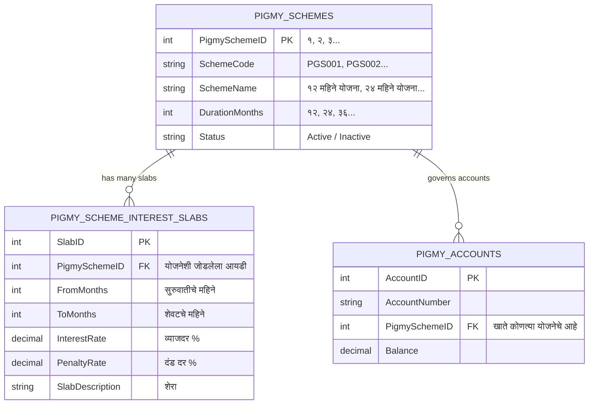

# बहुविध पिग्मी योजना व स्वतंत्र स्लॅब्स रचना: आर्किटेक्चर व अंमलबजावणी आराखडा
## (Multi-Scheme Dynamic Slabs Architecture & Implementation Plan)

---

### 📌 १. मुख्य प्रश्न व संकल्पना (The Core Question)
> **प्रश्न:** *"एका बँकेत अनेक पिग्मी योजना असू शकतात (उदा. योजना 'अ' ला ४ स्लॅब्स, योजना 'ब' ला ६ स्लॅब्स, योजना 'क' ला २ स्लॅब्स). ही प्रणाली एकाच वेळी वेगवेगळ्या योजनांसाठी स्वतंत्र स्लॅब कसे हाताळेल?"*

**थोडक्यात उत्तर:** 
हे कोर बँकिंगमधील **One-to-Many (१ योजना ➔ अनेक स्लॅब्स)** या रिलेशनल आर्किटेक्चरद्वारे चालते. प्रत्येक योजनेचे स्लॅब्स त्या योजनेच्या युनिक आयडी (`PigmySchemeID`) शी जोडलेले असतात. त्यामुळे योजना 'अ' च्या ४ स्लॅब्सचा योजना 'ब' च्या ६ स्लॅब्सशी अजिबात संबंध येत नाही. दोन्ही योजना १००% स्वतंत्रपणे काम करतात.

---

### 🏗️ २. रिलेशनल डेटाबेस रचना (Relational Database Design)



---

### 📊 ३. प्रत्यक्ष डेटाबेस उदाहरण (Live Database Example with 3 Different Schemes)

बँकेत ३ वेगवेगळ्या योजना आहेत असे मानू:
1. **योजना १ (`SchemeID = 1`):** १२ महिने नियमित पिग्मी (यात **४ स्लॅब्स** आहेत)
2. **योजना २ (`SchemeID = 2`):** २४ महिने दीर्घ मुदत पिग्मी (यात **६ स्लॅब्स** आहेत)
3. **योजना ३ (`SchemeID = 3`):** ६ महिने अल्प मुदत पिग्मी (यात **२ स्लॅब्स** आहेत)

#### टेबल १: `[dbo].[PigmySchemes]` (मुख्य योजना मास्टर)
| PigmySchemeID | SchemeCode | SchemeName | DurationMonths | एकूण स्लॅब्स संख्या |
| :---: | :---: | :--- | :---: | :---: |
| **1** | `PGS001` | १२ महिने दैनिक पिग्मी योजना | **१२** | **४ स्लॅब्स** |
| **2** | `PGS002` | २४ महिने विशेष पिग्मी ठेव | **२४** | **६ स्लॅब्स** |
| **3** | `PGS003` | ६ महिने अल्प मुदत पिग्मी | **६** | **२ स्लॅब्स** |

#### टेबल २: `[dbo].[PigmySchemeInterestSlabs]` (स्लॅब्स टेबल)
| SlabID | **PigmySchemeID** | किमान महिने (From) | कमाल महिने (To) | व्याजदर (%) | दंड दर (%) | नियम / शेरा |
| :---: | :---: | :---: | :---: | :---: | :---: | :--- |
| *१* | **1** | ० | ३ | 0.00 % | **2.00 %** | ० ते ३ महिने दंड (योजना १) |
| *२* | **1** | ३ | ६ | 0.00 % | **0.00 %** | ३ ते ६ महिने मुद्दल परत (योजना १) |
| *३* | **1** | ६ | ११ | **5.50 %** | 0.00 % | ६ ते ११ महिने अकाली व्याज (योजना १) |
| *४* | **1** | ११ | १२ | **6.50 %** | 0.00 % | ११ ते १२ महिने पूर्ण मुदत (योजना १) |
| --- | --- | --- | --- | --- | --- | --- |
| *५* | **2** | ० | ३ | 0.00 % | **2.50 %** | २४M योजना: ०-३ महिने दंड |
| *६* | **2** | ३ | ६ | 0.00 % | **1.00 %** | २४M योजना: ३-६ महिने दंड |
| *७* | **2** | ६ | १२ | **5.00 %** | 0.00 % | २४M योजना: ६-१२ महिने व्याज |
| *८* | **2** | १२ | १८ | **6.00 %** | 0.00 % | २४M योजना: १२-१८ महिने व्याज |
| *९* | **2** | १८ | २३ | **7.00 %** | 0.00 % | २४M योजना: १८-२३ महिने व्याज |
| *१०*| **2** | २३ | २४ | **8.00 %** | 0.00 % | २४M योजना: पूर्ण मुदत व्याज |
| --- | --- | --- | --- | --- | --- | --- |
| *११*| **3** | ० | ३ | 0.00 % | **2.00 %** | ६M योजना: ०-३ महिने दंड |
| *१२*| **3** | ३ | ६ | **4.50 %** | 0.00 % | ६M योजना: ३-६ महिने पूर्ण व्याज |

> **लक्षात घ्या:** `PigmySchemeID` मुळे प्रत्येक योजनेचे स्लॅब्स पूर्णपणे स्वतंत्र राहतात. योजना १ चा कोणताही स्लॅब योजना २ मध्ये मिसळत नाही!

---

### 🖥️ ४. फ्रंटएंड यूआय (UI) मध्ये हे कसे दिसेल आणि काम करेल?

#### १. नवीन योजना तयार करताना (Creating a New Scheme):
- ऑपरेटर जेव्हा **`+ नवीन योजना`** वर क्लिक करतो:
  - फॉर्म पूर्ण रिकामा होतो आणि सुरुवातीला एक स्टँडर्ड टेम्पलेट (उदा. ४ स्लॅब्स) दिसतो.
  - ऑपरेटरला २४ महिन्यांची योजना करायची असल्यास, तो खालील **`+ नवीन स्लॅब जोडा`** बटण दाबून ५ वा आणि ६ वा स्लॅब सहज जोडू शकतो!
  - शेवटच्या स्लॅबचे महिने २४ केल्यावर योजनेचा कालावधी आपोआप २४ महिने सेट होतो.
  - सेव्ह केल्यावर डेटाबेसमध्ये २४ महिने व त्याचे ६ स्लॅब्स स्वतंत्रपणे सेव्ह होतात.

#### २. आधी सेव्ह केलेली योजना एडिट करताना (Editing an Existing Scheme):
- ऑपरेटर जेव्हा **`📋 नोंदवलेली योजना यादी`** उघडतो:
  - तिथे योजना १ समोर **`📊 ४ स्लॅब्स (१२M)`** दिसेल.
  - योजना २ समोर **`📊 ६ स्लॅब्स (२४M)`** दिसेल.
  - योजना ३ समोर **`📊 २ स्लॅब्स (६M)`** दिसेल.
- **जेव्हा ऑपरेटर योजना १ च्या 'सुधारा (Edit)' वर क्लिक करतो:**
  - स्क्रीनवर योजना १ चे **नेमके तेच ४ स्लॅब्स** लोड होतात.
- **जेव्हा ऑपरेटर योजना २ च्या 'सुधारा (Edit)' वर क्लिक करतो:**
  - स्क्रीनवर योजना २ चे **नेमके तेच ६ स्लॅब्स** लोड होतात.
- फॉर्ममधील टेबल स्लॅब्सच्या संख्येनुसार आपोआप लहान किंवा मोठा होतो (Dynamic Rows).

---

### ⚙️ ५. ग्राहक खाते बंद करताना किंवा परतावा देताना (Calculation Engine):

जेव्हा एखादा ग्राहक पैसे काढायला येतो, तेव्हा सिस्टीम कशी ओळखते?
1. खाते उघडताना खात्यावर `PigmySchemeID` नोंदवलेला असतो.
2. उदा. ग्राहक **सुरेशचे खाते Scheme 1 (१२M)** चे आहे आणि त्याने **८ व्या महिन्यात** परतावा मागितला:
   ```sql
   SELECT * FROM PigmySchemeInterestSlabs 
   WHERE PigmySchemeID = 1 AND 8 >= FromMonths AND 8 < ToMonths
   ```
   👉 सिस्टीम फक्त **Scheme 1** चे स्लॅब्स शोधते. यात स्लॅब ३ (६ ते ११ महिने) लागू होऊन **५.५% व्याज** मिळते.
3. उदा. ग्राहक **रमेशचे खाते Scheme 2 (२४M)** चे आहे आणि त्याने **१५ व्या महिन्यात** परतावा मागितला:
   ```sql
   SELECT * FROM PigmySchemeInterestSlabs 
   WHERE PigmySchemeID = 2 AND 15 >= FromMonths AND 15 < ToMonths
   ```
   👉 सिस्टीम फक्त **Scheme 2** चे स्लॅब्स शोधते. यात स्लॅब ८ (१२ ते १८ महिने) लागू होऊन **६.०% व्याज** मिळते.

---

### 🚀 ६. अंमलबजावणी योजना (Implementation Plan Summary)

1. **फ्रंटएंड (`PigmySchemeMaster.tsx`):**
   - स्लॅब्सची संख्या फिक्स ४ न ठेवता डायनॅमिक ॲरे (`slabs: PigmySchemeInterestSlab[]`) ठेवणे.
   - `+ नवीन स्लॅब जोडा` फंक्शन: शेवटच्या स्लॅबच्या शेवटच्या महिन्यापासून पुढील स्लॅब जोडणे.
   - `🗑️ हटवा` फंक्शन: कोणताही नको असलेला स्लॅब काढणे.
   - योजना लोड करताना (`handleEdit`): त्या योजनेचे जितके स्लॅब्स असतील (२, ४, ५, ६) तितकेच रो टेबलमध्ये लोड करणे.
2. **बॅकएंड (`PigmySchemesController.cs`):**
   - `.Include(s => s.Slabs)` द्वारे प्रत्येक योजनेचे स्वतंत्र स्लॅब्स लोड आणि सेव्ह करणे (हे आधीच यशस्वीरीत्या तयार आहे).
3. **कमाल कालावधी ऑटो-कॅल्क्युलेशन:**
   - शेवटच्या स्लॅबचा `ToMonths` = त्या योजनेचा `DurationMonths`.

---
> **टीप:** या योजनेनुसार कोडमध्ये अद्याप कोणताही बदल केलेला नाही. ही बहुविध योजनांची स्वतंत्र स्लॅब रचना तुम्हाला मान्य असल्यास आपण पुढील पाऊल टाकू!
