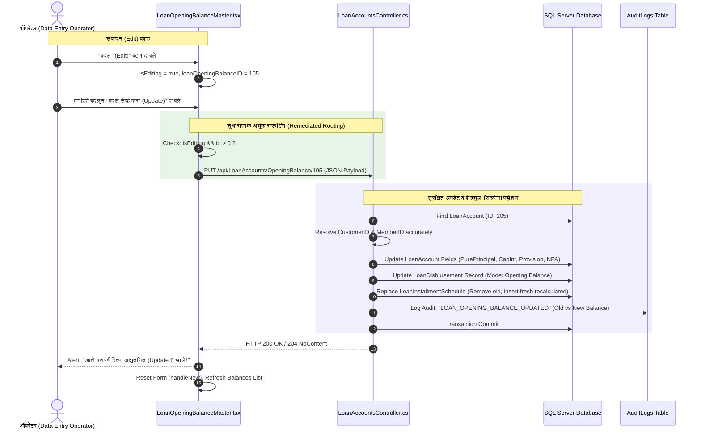

# 🛡️ सिस्टीम ऑडिटर सुधारात्मक कृती योजना (Remediation Plan)
## दोष क्र. १ [गंभीर / CRITICAL]: कर्ज आरंभिक शिल्लक संपादनामध्ये `PUT` ऐवजी `POST` कॉल — डुप्लिकेट खाते निर्मिती प्रतिबंध

---

### 📌 १. समस्या विश्लेषण व मूळ कारण (Root Cause Analysis)

#### अ. सद्यस्थितीतील त्रुटी:
1. **फ्रंटएंड (`LoanOpeningBalanceMaster.tsx`):**
   - जेव्हा ऑपरेटर सेव्ह केलेल्या खात्यांच्या यादीतून "बदला" (Edit) वर क्लिक करतो, तेव्हा `handleEdit(balance)` द्वारे:
     ```typescript
     loanOpeningBalanceID: balance.loanOpeningBalanceID || balance.loanAccountID
     setIsEditing(true)
     ```
     असा स्टेट सेट होतो.
   - परंतु, जेव्हा ऑपरेटर फॉर्ममधील माहिती दुरुस्त करून **"बदल सेव्ह करा (Update)"** बटण दाबतो, तेव्हा `handleSubmit` मधील नेटवर्क कॉल तपासल्यास:
     ```typescript
     // त्रुटीयुक्त जुना कोड:
     const response = await fetch(API_URL, {
       method: 'POST', // ❌ संपादन चालू असतानाही नेहमी POST जातो!
       headers: { 'Content-Type': 'application/json' },
       body: JSON.stringify(dataToSubmit)
     });
     ```
   - येथे `API_URL = '/api/LoanAccounts/OpeningBalance'` हार्डकोड असून, `isEditing` ची कोणतीही तपासणी न करता थेट `POST` विनंती पाठवली जात आहे.

2. **बॅकएंड (`LoanAccountsController.cs`):**
   - `[HttpPost("OpeningBalance")]` पद्धत आलेली प्रत्येक विनंती नवीन कर्ज खाते (`new LoanAccount`) समजून `_context.LoanAccounts.Add(...)` करते.
   - परिणामी, मूळ खाते अपडेट न होता, डेटाबेसमध्ये **तितक्याच रक्कमेचे दुसरे डुप्लिकेट कर्ज खाते** तयार होते.

#### ब. बँकिंग व आर्थिक जोखीम (Banking & Financial Risk):
* **बॅलन्स इन्फ्लेशन (Balance Inflation):** एकाच कर्जदाराचे ₹ ५,००,००० चे कर्ज अपडेट केल्यास डेटाबेसमध्ये दोन खाती होऊन एकूण बाकी ₹ १०,००,००० दिसेल.
* **तेरीज पत्रक विसंगती (Trial Balance Mismatch):** उप-खात्यांची बेरीज (Sub-Ledger Total) जनरल लेजर (GL Opening Balance) पेक्षा जास्त होईल.
* **दोन वेगवेगळे हप्ता तक्ते (Duplicate Schedules):** एकाच कर्जाचे दोन स्वतंत्र EMI वेळापत्रक तयार होऊन वसुली करताना गोंधळ उडेल.

---

### 🎯 २. प्रस्तावित आर्किटेक्चर व डेटा प्रवाह (Remediation Architecture)



---

### 📝 ३. तपशीलवार कोड बदल (Step-by-Step Implementation)

#### पायरी १: फ्रंटएंड दुरुस्ती — `LoanOpeningBalanceMaster.tsx`
`handleSubmit` मध्ये डायनॅमिक URL आणि HTTP Method (`PUT` vs `POST`) लागू करणे:

```typescript
// फाइल: client/src/components/LoanOpeningBalanceMaster.tsx

// 1. संपादन ओळख व योग्य एंडपॉईंट निवड
const isEditMode = isEditing && Boolean(formData.loanOpeningBalanceID && formData.loanOpeningBalanceID > 0);
const targetUrl = isEditMode 
  ? `${API_URL}/${formData.loanOpeningBalanceID}` 
  : API_URL;
const targetMethod = isEditMode ? 'PUT' : 'POST';

// 2. अचूक HTTP कॉल
const response = await fetch(targetUrl, {
  method: targetMethod,
  headers: {
    'Content-Type': 'application/json'
  },
  body: JSON.stringify(dataToSubmit)
});

if (response.ok) {
  alert(isEditMode ? 'कर्ज खाते यशस्वीरित्या अद्यतनित (Updated) झाले!' : 'नवीन कर्ज आरंभिक शिल्लक यशस्वीरित्या नोंदवली (Saved) गेली!');
  fetchBalances();
  handleNew();
} else {
  const errText = await response.text();
  alert('त्रुटी आली: ' + errText);
}
```

#### पायरी २: बॅकएंड दुरुस्ती — `LoanAccountsController.cs` (`PutOpeningBalance`)
`PutOpeningBalance` पद्धतीमध्ये:
1. `CustomerID` योग्यरित्या मॅप करणे (पूर्वी केवळ `MemberID` मॅप होत होता).
2. जर खाते NPA असेल (`InitialNpaClassification != "Standard"`), तर `LoanAccountNpaStatuses` मध्ये स्थिती अपडेट करणे.
3. फॉरेन्सिक ऑडिटसाठी `AuditLogs` मध्ये नोंदी समाविष्ट करणे.

```csharp
// फाइल: api/Bhisi.Api/Controllers/LoanAccountsController.cs
// PutOpeningBalance(int id, LoanOpeningBalanceDto dto) मध्ये सुधारणा:

// अ. Customer व Member योग्यरित्या रिझॉल्व्ह करणे
Customer? customer = null;
Member? borrower = null;
if (dto.CustomerID.HasValue && dto.CustomerID.Value > 0)
{
    customer = await _context.Customers.FindAsync(dto.CustomerID.Value);
    if (customer != null) borrower = await _context.Members.FirstOrDefaultAsync(m => m.CustomerID == customer.CustomerID);
}
else if (dto.MemberID.HasValue && dto.MemberID.Value > 0)
{
    borrower = await _context.Members.Include(m => m.Customer).FirstOrDefaultAsync(m => m.MemberID == dto.MemberID.Value);
    if (borrower != null && borrower.CustomerID > 0) customer = await _context.Customers.FindAsync(borrower.CustomerID);
}

loanAccount.CustomerID = customer?.CustomerID ?? (borrower?.CustomerID > 0 ? borrower.CustomerID : loanAccount.CustomerID);
loanAccount.MemberID = borrower?.MemberID ?? dto.MemberID;

// ब. ऑडिट लॉग तयार करणे
_context.AuditLogs.Add(new AuditLog
{
    UserID = 1,
    Username = "Manager",
    Action = "LOAN_OPENING_BALANCE_UPDATED",
    EntityName = "LoanAccount",
    EntityID = id.ToString(),
    Timestamp = DateTime.Now,
    Details = $"Loan Opening Balance Updated: A/C {loanAccount.LoanAccountNo}. Principal: ₹{loanAccount.PrincipalBalance:N2} (Pure: ₹{loanAccount.PurePrincipalBalance:N2}, CapInt: ₹{loanAccount.CapitalizedInterestAmount:N2}), Int: ₹{loanAccount.InterestBalance:N2}, Prov: ₹{loanAccount.InterestProvisionBalance:N2}, NPA: {loanAccount.InitialNpaClassification}"
});
```

#### पायरी ३: बॅकएंड डिफेन्सिव्ह गार्ड — `PostOpeningBalance` मध्ये प्रतिबंध
जर चुकून क्लायंटकडून किंवा बाहेरील टूलवरून `POST` मध्ये आधीच अस्तित्वात असलेला `LoanOpeningBalanceID > 0` आला, तर बॅकएंडने नवीन डुप्लिकेट खाते न बनवता सुरक्षितपणे `PutOpeningBalance` कडे वळवणे अथवा त्रुटी देणे.

---

### 🧪 ४. चाचणी व पडताळणी योजना (Verification & Test Cases)

| चाचणी क्र. | चाचणी प्रसंग (Scenario) | अपेक्षित निकाल (Expected Outcome) | पडताळणी पद्धत |
| :---: | :--- | :--- | :--- |
| **TC-01** | नवीन खाते नोंदवणे | HTTP POST `/api/LoanAccounts/OpeningBalance` कॉल होतो व नवीन ID चे खाते तयार होते. | Network Tab + DB Query |
| **TC-02** | आधी नोंदवलेले खाते "बदला" (Edit) करून सेव्ह करणे | HTTP PUT `/api/LoanAccounts/OpeningBalance/{id}` कॉल होतो; **नवीन खाते तयार होत नाही**, मूळ खात्याचाच डेटा अपडेट होतो. | Network Tab + Record Count Check |
| **TC-03** | एकूण खात्यांची संख्या तपासणे | संपादन करण्यापूर्वी एकूण खाती = N; संपादन केल्यानंतरही एकूण खाती = N (N+1 होत नाही). | UI KPI Badge + DB Count |
| **TC-04** | हप्ता तक्ता (Installment Schedule) पुनर्निर्मिती | संपादन करताना हप्ते किंवा व्याज बदलल्यास जुने हप्ते डिलीट होऊन नवीन अचूक हप्ते जुळतात. | `LoanInstallmentSchedules` Table |
| **TC-05** | ऑडिट ट्रेल पडताळणी | संपादन पूर्ण होताच `AuditLogs` मध्ये `LOAN_OPENING_BALANCE_UPDATED` नोंद होते. | `AuditLogs` Table Query |

---

### 📋 ५. ऑडिटर मंजुरी निकष (Sign-Off Criteria)
1. संपादन (Edit) प्रक्रियेत डेटाबेसमध्ये कोणत्याही परिस्थितीत नवीन रेकॉर्ड इन्सर्ट होता कामा नये (`No INSERT, only UPDATE`).
2. नेटवर्क ट्रॅफिकमध्ये HTTP 200/204 सह अचूक `PUT` मेथड दिसावी.
3. .NET 8 आणि Vite TypeScript बिल्ड `0 Errors` सह यशस्वी व्हावे.
