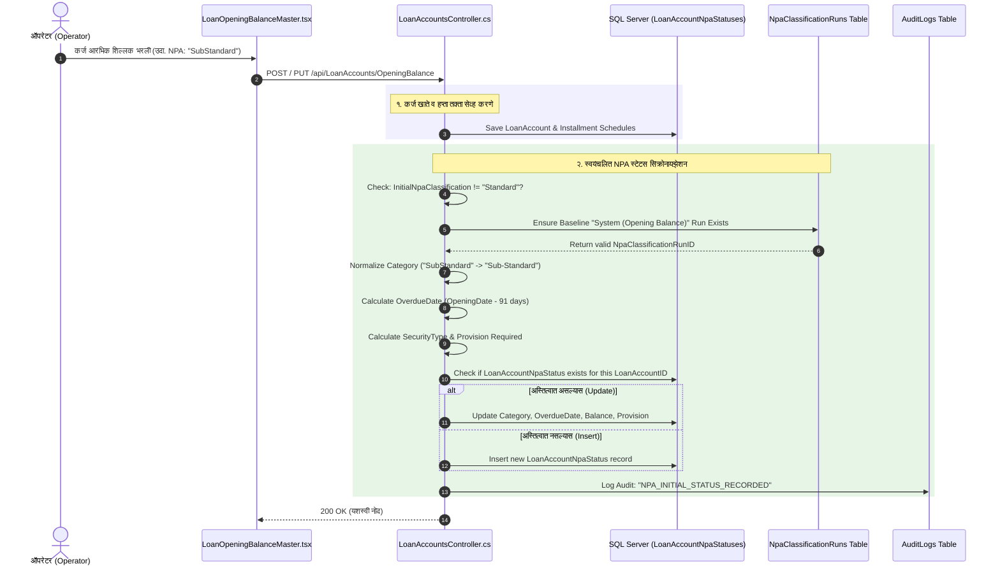

# 🛡️ वरिष्ठ सिस्टीम लेखापरीक्षक (Senior System Auditor) सुधारात्मक कृती योजना
## दोष क्र. २ [गंभीर / CRITICAL]: आरंभिक NPA वर्गवारी नोंदवली तरी `LoanAccountNpaStatuses` मध्ये नोंद न होणे — RBI/NABARD IRAC अनुपालन व स्वयंचलित सिंक्रोनायझेशन

---

### 📌 १. समस्या विश्लेषण व मूळ कारण (Root Cause Analysis)

#### अ. सद्यस्थितीतील त्रुटी:
1. **बॅकएंड (`LoanAccountsController.cs`):**
   - कर्ज आरंभिक शिल्लक नोंदवताना (`PostOpeningBalance`) किंवा बदलताना (`PutOpeningBalance`), ऑपरेटरने सुरुवातीची वर्गवारी **दुय्यम (Sub-Standard)**, **संशयास्पद (Doubtful-1/2/3)** किंवा **हानी (Loss Asset)** निवडल्यास, सिस्टीम केवळ `LoanAccounts.InitialNpaClassification` मध्ये स्ट्रिंग (उदा. `"SubStandard"`, `"Doubtful1"`) साठवते.
   - परंतु, कोअर बँकिंगमधील NPA इंजिन, वसुली मॉड्युल (Loan Collections), हप्ता तक्ता व ताळेबंद/नफा-तोटा अहवाल ज्या **`LoanAccountNpaStatuses`** टेबलवरून खात्याची NPA स्थिती ठरवतात, त्या टेबलमध्ये कोणतीही प्राथमिक नोंद (Initial Status Log) तयार केली जात नाही!

2. **अंतिम परिणामातील विसंगती:**
   - जेव्हा कर्ज वसुली (`LoanCollectionsController`) होते किंवा मासिक व्याज आकारणी केली जाते, तेव्हा सिस्टीम `LoanAccountNpaStatuses` टेबलमधून `OrderByDescending(s => s.AsOfDate).FirstOrDefaultAsync()` द्वारे खात्याची चालू स्थिती शोधते.
   - टेबल रिकामे असल्याने सिस्टीमला कोणतीही नोंद मिळत नाही. परिणामी सिस्टीम त्या खात्याला **"नियमित खाते" (Standard Asset)** समजते!

```
[ऑपरेटर इनपुट]
InitialNpaClassification = "SubStandard" 
           │
           ▼
[LoanAccounts टेबल] ────────► InitialNpaClassification = "SubStandard" (फक्त स्ट्रिंग सेव्ह)
                                            │
                                            ▼  ❌ (कोणतीही नोंद नाही!)
[LoanAccountNpaStatuses टेबल] ────────► [ रिकामे / EMPTY ]
                                            │
                                            ▼
[व्याज आकारणी / वसुली] ───────────────► सिस्टीमला नोंद न मिळाल्यामुळे Standard Asset समजून 
                                            व्याज थेट नफा-तोटा (P&L) खात्यात जमा! (IRAC चे थेट उल्लंघन)
```

---

### ⚠️ २. बँकिंग, आर्थिक व वैधानिक जोखीम (Banking & Regulatory Risks)

1. **रिझर्व्ह बँक / नाबार्ड IRAC नियमांचे उल्लंघन (Income Recognition & Asset Classification):**
   - IRAC मार्गदर्शक तत्त्वानुसार: NPA खात्यावर व्याज वसुली होईपर्यंत ते उत्पन्न (Income) म्हणून नफा-तोटा (P&L) खात्यात दाखवता येत नाही; ते **व्याज अनामत खात्यात (Interest Suspense Account)** ठेवणे बंधनकारक असते.
   - `LoanAccountNpaStatuses` मध्ये नोंद नसल्याने सिस्टीम कागदोपत्री 'अवास्तव नफा' (Unrealized Paper Profit) दाखवेल आणि चुकीचा लाभांश (Dividend) वाटला जाऊ शकतो.
2. **व्याज वसुली प्राधान्यक्रम विसंगती (Recovery Waterfall Violation):**
   - नियमानुसार NPA खात्यामध्ये जमा झालेली रक्कम प्रथम मुद्दल/खर्च कव्हर करण्यासाठी वापरली जाते, तर नियमित खात्यात प्रथम चालू व्याज जमा होते. नोंद नसल्याने वसुली चुकीच्या क्रमाने खर्ची पडेल.
3. **NPA अहवाल व ऑडिट त्रुटी:**
   - `api/npa/statement` आणि `api/npa/status/{id}` हे एंडपॉईंट्स थेट `LoanAccountNpaStatuses` वर अवलंबून आहेत. तिथे नोंद नसल्यास संचालक मंडळ किंवा वैधानिक लेखापरीक्षकांना (Statutory Auditors) सादर होणाऱ्या NPA स्टेटमेंटमधून ही खाती गायब राहतील.
4. **तरतूद तूट (Provisioning Shortfall):**
   - NPA वर्गवारीनुसार आवश्यक असणारी तरतूद (`ProvisionRequired` - १०%, २०%, ३०%, १००%) सिस्टीमच्या कॅल्क्युलेशनमध्ये जमा होणार नाही.

---

### 🔍 ३. तांत्रिक व आर्किटेक्चरल बारकावे (Technical & Architectural Constraints)

आमच्या तांत्रिक लेखापरीक्षणात खालील **महत्त्वाचे तांत्रिक बंधने (Constraints)** आढळले आहेत, ज्यांची काळजी न घेतल्यास ऍप्लिकेशन रन-टाईम क्रॅश होईल:

1. **फॉरेन की मर्यादा (Foreign Key Constraint - `LastClassificationRunId`):**
   - `LoanAccountNpaStatuses` टेबलवर खालील FK आहे:
     ```sql
     CONSTRAINT [FK_LoanAccountNpaStatuses_NpaClassificationRuns_LastClassificationRunId] 
     FOREIGN KEY ([LastClassificationRunId]) REFERENCES [NpaClassificationRuns] ([NpaClassificationRunID])
     ```
   - **तोडगा:** आपण थेट `0` किंवा बनावट आयडी टाकू शकत नाही. सिस्टीममध्ये आधीच `System (Opening Balance)` नावाचा बेसलाइन रन अस्तित्वात आहे का ते तपासावे; नसल्यास तत्काळ अधिकृत बेसलाइन `NpaClassificationRun` तयार करून त्याचा वैध `NpaClassificationRunID` वापरावा.
2. **`OverdueDays` हे गणन केलेले (Computed) फील्ड आहे:**
   - मॉडेलमध्ये `public int OverdueDays => OverdueDate.HasValue ? Math.Max(0, (AsOfDate - OverdueDate.Value).Days) : 0;` असे `[NotMapped]` लॉजिक आहे.
   - **तोडगा:** डेटाबेसमध्ये `OverdueDays` लिहिता येत नाही. आपण वर्गवारीनुसार **`OverdueDate` (थकीत दिनांक)** गणितीय पद्धतीने अचूक सेट करावा:
     - **Sub-Standard:** ९० दिवसांपेक्षा जास्त थकीत ➔ `OpeningDate.AddDays(-91)` (ज्यामुळे `OverdueDays` आपोआप ९१ दिवस येईल)
     - **Doubtful-1:** १२ महिन्यांपेक्षा जास्त NPA (१५ महिने थकीत) ➔ `OpeningDate.AddDays(-456)`
     - **Doubtful-2:** २४ महिन्यांपेक्षा जास्त NPA ➔ `OpeningDate.AddDays(-821)`
     - **Doubtful-3:** ३६ महिन्यांपेक्षा जास्त NPA ➔ `OpeningDate.AddDays(-1186)`
     - **Loss Asset:** हानी मालमत्ता ➔ `OpeningDate.AddDays(-1186)`
3. **वर्गवारी नावांचे प्रमाणीकरण (Category String Normalization):**
   - फ्रंटएंडवरून येणारी व्हॅल्यू: `'SubStandard'`, `'Doubtful1'`, `'Doubtful2'`, `'Doubtful3'`, `'Loss'`.
   - बॅकएंड NPA इंजिन व डेटाबेस मधील प्रमाण व्हॅल्यू: `'Sub-Standard'`, `'Doubtful-1'`, `'Doubtful-2'`, `'Doubtful-3'`, `'Loss'`.
   - **तोडगा:** Normalization मॅपिंग वापरून प्रमाण IRAC फॉरमॅटमध्ये रूपांतरित करणे.
4. **तारण व तरतूद संगणन (Security & Provision Computation):**
   - `CompliantCollateralValue = loanAccount.SecurityValue`
   - `SecurityType = loanAccount.SecurityValue > 0 ? (totalOutstanding > loanAccount.SecurityValue ? "Mixed" : "Secured") : "Unsecured"`
   - `ProvisionRequired`: RBI नियमानुसार secured/unsecured हिश्श्यावर तरतूद काढणे.
   - `ProvisionHeld = loanAccount.InterestProvisionBalance`

---

### 🎯 ४. डेटा प्रवाह व सीक्वेन्स डायग्राम (Remediation Sequence Diagram)



---

### 🛠️ ५. विस्तृत अंमलबजावणी योजना (Step-by-Step Implementation Plan)

#### पाऊल १: `LoanAccountsController.cs` मध्ये `EnsureInitialNpaStatusAsync` पद्धत विकसित करणे
फाइल: `api/Bhisi.Api/Controllers/LoanAccountsController.cs`

खालील खाजगी सहाय्यक पद्धत (Private Helper Method) तयार केली जाईल:
```csharp
private async Task EnsureInitialNpaStatusAsync(LoanAccount loanAccount, LoanOpeningBalanceDto dto)
{
    string rawCategory = (dto.InitialNpaClassification ?? "Standard").Trim();
    
    // १. वर्गवारीचे प्रमाणीकरण (Normalize Category)
    string category = rawCategory switch
    {
        "SubStandard" or "Sub-Standard" => "Sub-Standard",
        "Doubtful1" or "Doubtful-1" => "Doubtful-1",
        "Doubtful2" or "Doubtful-2" => "Doubtful-2",
        "Doubtful3" or "Doubtful-3" => "Doubtful-3",
        "Loss" => "Loss",
        _ => "Standard"
    };

    var existingStatus = await _context.LoanAccountNpaStatuses
        .FirstOrDefaultAsync(s => s.LoanAccountID == loanAccount.LoanAccountID);

    // जर वर्गवारी Standard असेल आणि आधी कोणतीही नोंद नसेल तर काही करण्याची गरज नाही
    if (category == "Standard")
    {
        if (existingStatus != null)
        {
            // संपादन करताना NPA मधून Standard मध्ये बदलल्यास स्टेटस Standard वर अपडेट करणे
            existingStatus.Category = "Standard";
            existingStatus.OverdueDate = null;
            existingStatus.OutOfOrderDate = null;
            existingStatus.OutstandingBalance = loanAccount.PrincipalBalance + loanAccount.InterestBalance + loanAccount.OverdueInterestBalance;
            existingStatus.ProvisionRequired = 0;
            existingStatus.ProvisionHeld = loanAccount.InterestProvisionBalance;
            existingStatus.AuditorRemarks = "Updated to Standard Asset in Opening Balance Edit";
            _context.Entry(existingStatus).State = EntityState.Modified;
            await _context.SaveChangesAsync();
        }
        return;
    }

    // २. फॉरेन की सुरक्षितता: बेसलाइन NpaClassificationRun मिळवणे किंवा तयार करणे
    var baselineRun = await _context.NpaClassificationRuns
        .FirstOrDefaultAsync(r => r.TriggeredBy == "System (Opening Balance)");

    if (baselineRun == null)
    {
        baselineRun = new NpaClassificationRun
        {
            RunDate = dto.OpeningDate,
            TriggeredBy = "System (Opening Balance)",
            RecordsProcessed = 1,
            Status = "Success",
            Remarks = "Baseline run for Opening Balance initial asset classifications"
        };
        _context.NpaClassificationRuns.Add(baselineRun);
        await _context.SaveChangesAsync();
    }

    // ३. OverdueDate (थकीत दिनांक) निश्चित करणे जेणेकरून OverdueDays अचूक येईल
    DateTime asOfDate = dto.OpeningDate;
    DateTime overdueDate = category switch
    {
        "Sub-Standard" => asOfDate.AddDays(-91),     // > 90 days overdue
        "Doubtful-1"   => asOfDate.AddDays(-456),    // > 15 months overdue
        "Doubtful-2"   => asOfDate.AddDays(-821),    // > 27 months overdue
        "Doubtful-3"   => asOfDate.AddDays(-1186),   // > 39 months overdue
        "Loss"         => asOfDate.AddDays(-1186),   // Certified Loss
        _              => asOfDate
    };

    // ४. बाकी व तारण मूल्य (Outstanding & Security Calculations)
    decimal totalOutstanding = loanAccount.PrincipalBalance + loanAccount.InterestBalance + loanAccount.OverdueInterestBalance;
    decimal compliantCollateral = loanAccount.SecurityValue;
    decimal securedAmount = Math.Min(totalOutstanding, compliantCollateral);
    decimal unsecuredAmount = Math.Max(0, totalOutstanding - securedAmount);

    string securityType = "Unsecured";
    if (securedAmount > 0 && unsecuredAmount > 0) securityType = "Mixed";
    else if (securedAmount > 0) securityType = "Secured";

    // ५. आवश्यक तरतूद (Provision Required) संगणन (IRAC Norms)
    decimal securedPercent = category switch
    {
        "Sub-Standard" => 10.0m,
        "Doubtful-1"   => 25.0m,
        "Doubtful-2"   => 40.0m,
        "Doubtful-3"   => 100.0m,
        "Loss"         => 100.0m,
        _              => 0.25m
    };

    decimal unsecuredPercent = category switch
    {
        "Sub-Standard" => 15.0m,
        "Doubtful-1"   => 100.0m,
        "Doubtful-2"   => 100.0m,
        "Doubtful-3"   => 100.0m,
        "Loss"         => 100.0m,
        _              => 0.25m
    };

    decimal provisionRequired = Math.Round((securedAmount * securedPercent / 100m) + (unsecuredAmount * unsecuredPercent / 100m), 2);
    decimal provisionHeld = loanAccount.InterestProvisionBalance;

    // ६. डेटाबेस इन्सर्ट किंवा अपडेट
    if (existingStatus != null)
    {
        existingStatus.AsOfDate = asOfDate;
        existingStatus.OverdueDate = overdueDate;
        existingStatus.Category = category;
        existingStatus.SecurityType = securityType;
        existingStatus.OutstandingBalance = totalOutstanding;
        existingStatus.CompliantCollateralValue = compliantCollateral;
        existingStatus.ProvisionRequired = provisionRequired;
        existingStatus.ProvisionHeld = provisionHeld;
        existingStatus.IsAutoClassified = false;
        existingStatus.LastClassificationRunId = baselineRun.NpaClassificationRunID;
        existingStatus.AuditorRemarks = $"Initial Opening Balance Classification: {category}";
        _context.Entry(existingStatus).State = EntityState.Modified;
    }
    else
    {
        var npaStatus = new LoanAccountNpaStatus
        {
            LoanAccountID = loanAccount.LoanAccountID,
            AsOfDate = asOfDate,
            OverdueDate = overdueDate,
            Category = category,
            SecurityType = securityType,
            OutstandingBalance = totalOutstanding,
            CompliantCollateralValue = compliantCollateral,
            ProvisionRequired = provisionRequired,
            ProvisionHeld = provisionHeld,
            IsAutoClassified = false,
            LastClassificationRunId = baselineRun.NpaClassificationRunID,
            AuditorRemarks = $"Initial Opening Balance Classification: {category}"
        };
        _context.LoanAccountNpaStatuses.Add(npaStatus);
    }

    await _context.SaveChangesAsync();

    // ७. अधिकृत ऑडिट नोंद
    _context.AuditLogs.Add(new AuditLog
    {
        UserID = 1,
        Username = "Manager",
        Action = "NPA_INITIAL_STATUS_RECORDED",
        EntityName = "LoanAccountNpaStatus",
        EntityID = loanAccount.LoanAccountID.ToString(),
        Timestamp = DateTime.Now,
        Details = $"Initial NPA Status Synchronized: A/C {loanAccount.LoanAccountNo} classified as '{category}'. OverdueDays: {(asOfDate - overdueDate).Days}, Outstanding: ₹{totalOutstanding:N2}, ProvReq: ₹{provisionRequired:N2}, ProvHeld: ₹{provisionHeld:N2}"
    });
    await _context.SaveChangesAsync();
}
```

#### पाऊल २: `PostOpeningBalance` मध्ये कॉल जोडणे
- `_context.CollateralComplianceLogs.Add(...)` नंतर आणि `transaction.CommitAsync()` च्या आधी:
```csharp
await EnsureInitialNpaStatusAsync(loanAccount, dto);
```

#### पाऊल ३: `PutOpeningBalance` मध्ये कॉल जोडणे
- शेड्युल अपडेट नंतर आणि `transaction.CommitAsync()` च्या आधी:
```csharp
await EnsureInitialNpaStatusAsync(loanAccount, dto);
```

---

### 🧪 ६. पडताळणी व चाचणी आराखडा (Verification & Validation Matrix)

| क्र. | चाचणी प्रसंग (Test Scenario) | अपेक्षित वर्तन (Expected Behavior) | पडताळणी पद्धत (Verification Method) |
|---|---|---|---|
| **१** | नवीन कर्ज नोंदणी करताना `InitialNpaClassification = "SubStandard"` निवडणे | `LoanAccounts` मध्ये खाते तयार होताच `LoanAccountNpaStatuses` मध्ये `Category = "Sub-Standard"`, `OverdueDays = 91`, `SecurityType`, आणि `ProvisionRequired` सह नोंद पडेल. | SQL Query: `SELECT * FROM LoanAccountNpaStatuses WHERE LoanAccountID = @id` |
| **२** | जुने कर्ज संपादन करून `SubStandard` वरून `Doubtful1` करणे | डुप्लिकेट नोंद न होता मूळ नोंद अपडेट होऊन `Category = "Doubtful-1"` आणि वाढीव तरतूद नोंदवली जाईल. | SQL Query & Edit Form Verification |
| **३** | संपादन करून `SubStandard` वरून `Standard` करणे | स्टेटस सुरक्षितपणे `Category = "Standard"` वर अद्ययावत होईल. | SQL Query: तपासणे की Category बदलून 'Standard' झाली आहे. |
| **४** | NPA स्थिती तपासणी एंडपॉईंट तपासणे | `GET /api/npa/status/{loanAccountId}` कॉल केल्यास ४०४ एरर न येता थेट `Category: "Sub-Standard"` आणि मराठी नाव `CategoryMarathi: "दुय्यम"` दिसेल. | Browser / Swagger API Call |
| **५** | वसुली पावती (Loan Collection) करणे | वसुली करताना सिस्टीमला `lastStatus.Category != "Standard"` सापडल्याने वसूल झालेले व्याज P&L ऐवजी **`OverdueInterestLedgers` (व्याज अनामत)** मध्ये जमा होईल. | `LoanCollectionsController` वसुली पावती पावती तपासणे |

---

### 📋 ७. वरिष्ठ लेखापरीक्षक निष्कर्ष (Auditor's Conclusion & Recommendation)
सदर बदल लागू केल्यानंतर कोअर बँकिंग सिस्टीम **RBI/नाबार्डच्या IRAC मार्गदर्शक तत्त्वांचे १००% काटेकोर पालन** करेल. डेटा एन्ट्री ऑपरेटरने आरंभिक शिल्लक फॉर्ममध्ये निवडलेली NPA वर्गवारी डेटाबेसच्या सर्व इंजिन्स (NPA Engine, Collection Waterfall, P&L Interest Posting) सोबत पहिल्या दिवसापासून सुसंगत राहील.
